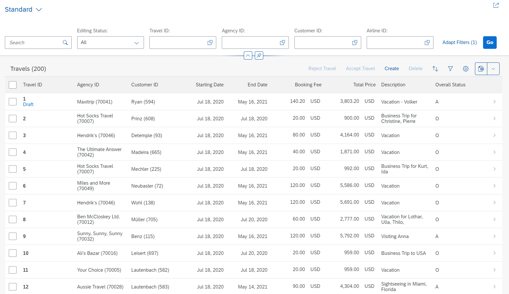

# DEV260 - Build SAP Fiori Apps with the ABAP RESTful Application Programming Model

## Description

This repository contains the material for the SAP TechEd 2020 session called **DEV260** - **Build SAP Fiori Apps with the ABAP RESTful Application Programming Model**.  

## Disclaimer

> Note that this workshop was first offered in 2020; consequently, all its assets were created before the branding changes related to SAP technology were announced in January 2021. For example, SAP Cloud Platform, ABAP environment has been renamed to SAP Business Technology Platform (BTP), ABAP environment.

## Overview

In this session we will guide you to build a draft-enabled transactional SAP Fiori Elements Application based on the ABAP RESTful Application Programming Model (in short RAP). The underlying OData service will be exposed using the OData V4 protocol, and the resulting app will look like this:

The Fiori app you are going to implement is based on the RAP Flight Reference Scenario. To set the business context the scenario is the following: The department responsible for managing worldwide Travels for multiple Agencies is requesting you to build a new Fiori app with draft capabilities for processing (i.e. creating, updating and deleting) Travels.

Presentation: [DEV260 - Build SAP Fiori Apps with the ABAP RESTful Application Programming Model](presentation/DEV260.pdf)

Further reading: [Developing Transactional Apps with Draft Capabilities](https://help.sap.com/viewer/923180ddb98240829d935862025004d6/Cloud/en-US/71ba2bec1d0d4f22bc344bba6b569f2e.html)

## Requirements

The requirements to follow the exercises in this repository are:

* You have installed the _latest_ ABAP Development Tools (ADT), see [ABAP Development Tools](https://tools.hana.ondemand.com/#abap)
* You have created a SAP Cloud Platform ABAP Environment Trial Account and connected your ADT to the Trial Account using a ABAP Cloud Project, see [Create an SAP Cloud Platform ABAP Environment Trial User](https://developers.sap.com/tutorials/abap-environment-trial-onboarding.html)

## Exercises

Follow these steps to build a draft-enabled transactional Fiori app with RAP. 

The **Fast Track** uses a tool to generate the artefacts of exercises 1-4. In the **Regular Track** you create them manually, step-by-step.

| Regular Track | Fast Track |
| ------------- | ---------- |
| [Getting Started - Regular Track](exercises/ex0/) | [Getting Started - Fast Track](exercises/ex0/README_fast_track.md) | 
| [Exercise 1 - Database Tables](exercises/ex1/) | [Exercises 1-4 - Generate Data Model](exercises/ex1_4/#readme) |
| [Exercise 2 - Core Data Services (CDS) Data Model](exercises/ex2/) |
| [Exercise 3 - CDS Data Model Projection](exercises/ex3/) |
| [Exercise 4 - Metadata Extensions](exercises/ex4/) |
| [Exercise 5 - Business Service](exercises/ex5/) | [Exercise 5 - Business Service](exercises/ex5/) |
| [Exercise 6 - Business Object Behavior](exercises/ex6/) | [Exercise 6 - Business Object Behavior](exercises/ex6/) |
| [Exercise 7 - Actions](exercises/ex7/) | [Exercise 7 - Actions](exercises/ex7/) |
| [Exercise 8 - Determinations](exercises/ex8/) | [Exercise 8 - Determinations](exercises/ex8/) |
| [Exercise 9 - Validations](exercises/ex9/) | [Exercise 9 - Validations](exercises/ex9/) |
| [Exercise 10 - Authorizations (optional)](exercises/ex10/) | [Exercise 10 - Authorizations (optional)](exercises/ex10/) |

## How to obtain support

Support for the content in this repository is available during the actual time of the online session for which this content has been designed. Otherwise, you may request support via the [Issues](../../issues) tab.

## License
Copyright (c) 2020 SAP SE or an SAP affiliate company. All rights reserved. This file is licensed under the Apache Software License, version 2.0 except as noted otherwise in the [LICENSE](LICENSES/Apache-2.0.txt) file.
