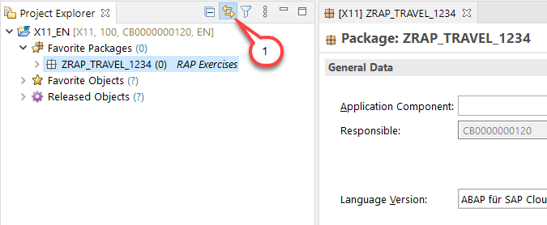

# Getting Started - Fast Track

## Introduction
You've already created an ABAP Trial Account and connected your ADT to it using a ABAP Cloud Project as described in the [Requirements](../../../../#requirements) section.

Please note that ADT dialogs and views as well as Fiori UIs may change in upcoming releases.

> **Hints and Tips**    
> Speed up typing by making use of the Code Completion feature (shortcut Ctrl+Space) and the prepared code snippets provided. 
> You can easily open an object with the shortcut *Ctrl+Shift+A*, format your source code using the Pretty Printer feature *Shift+F1* and toggle the fullscreen of the editor using the shortcut *Ctrl+M*.
>
> An overview of ADT shortcuts can be found here: [Useful ADT Shortcuts](https://blogs.sap.com/2013/11/21/useful-keyboard-shortcuts-for-abap-in-eclipse/)

## Group ID

As the ABAP Trial environment is used by many people, we've defined a naming pattern for each artefact you are going to create to make sure it doesn't conflict with other ones. For this you'll find the placeholder **`####`** used in object names that must be replaced with the group ID of your choice during the exercises. 

The group ID will be generated for you in the next exercise and it contains 4 numbers. 

> **Hints and Tips**    
> The screenshots in this document have been taken using group ID `1234` and system `X11`. 

## Find/Replace

In the course of these exercises you will frequently see the task to "_replace the placeholder `####` with your group ID_". For this it's recommended to make use of the **Find/Replace** feature of the Eclipse Editor. It can be opened either via the menu (**_Edit -> Find/Replace..._**) or via **Ctrl+F**.
  
   
   
   Choosing **Replace All** allows you to replace all ocurrences of `####` with your group ID.

## Link with Editor (Optional) 

Enable the **Link with Editor** option. Whenever this option is enabled, the current object in the editor will be automatically selected in the expanded Project Explorer tree.

   

## Summary

Now you can continue with the following exercise:
   - \[Fast Track\]: [Exercises 1-4 - Generate Data Model](../ex1_4/README.md) to generate the data model
  
