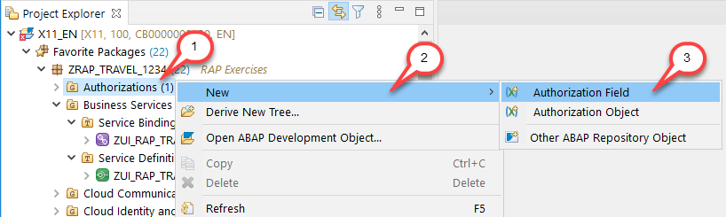
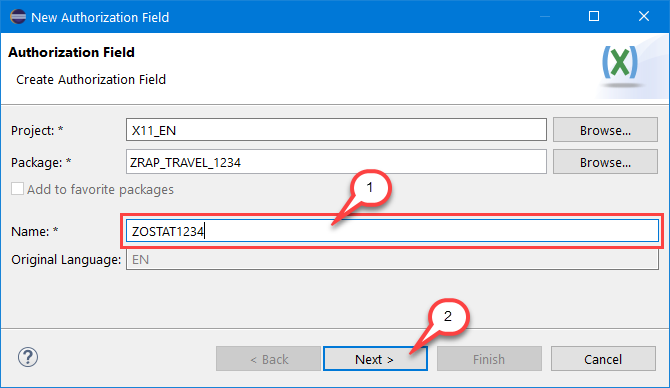
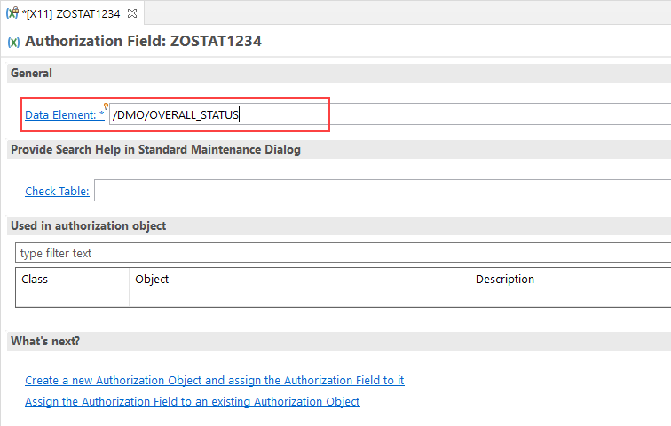
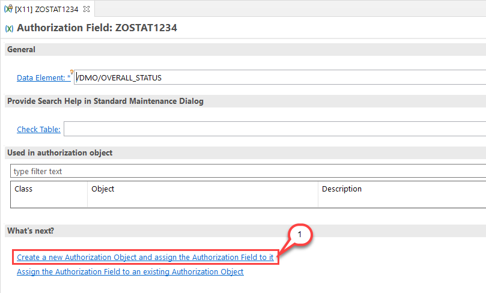
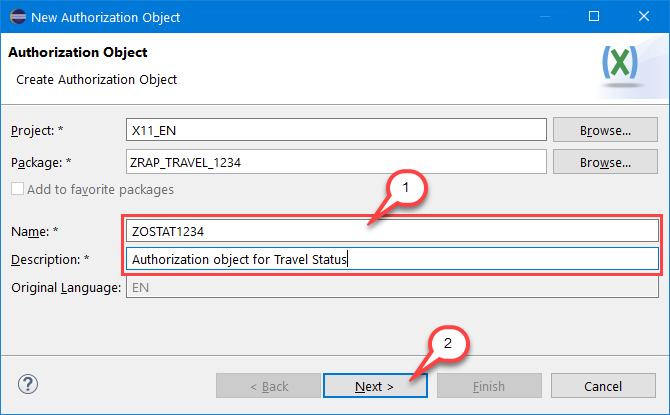
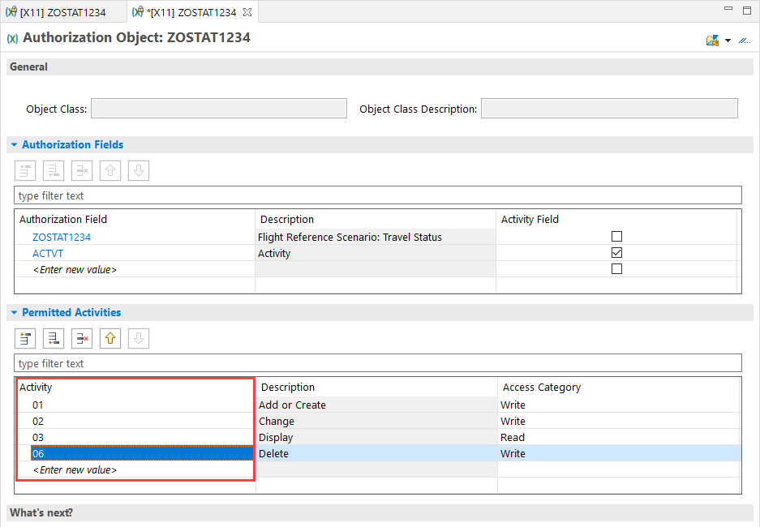
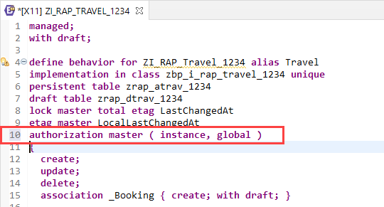
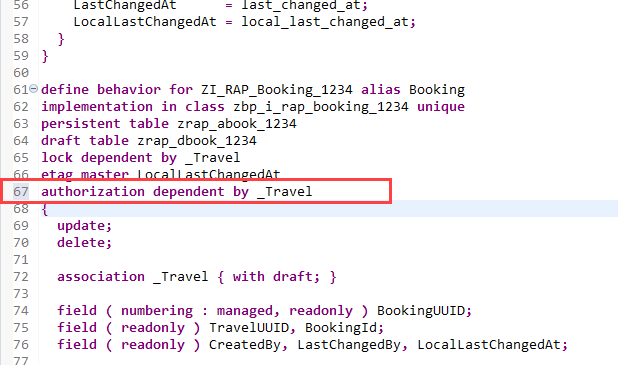
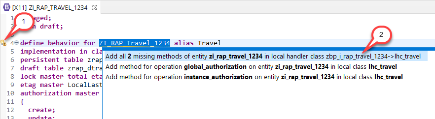
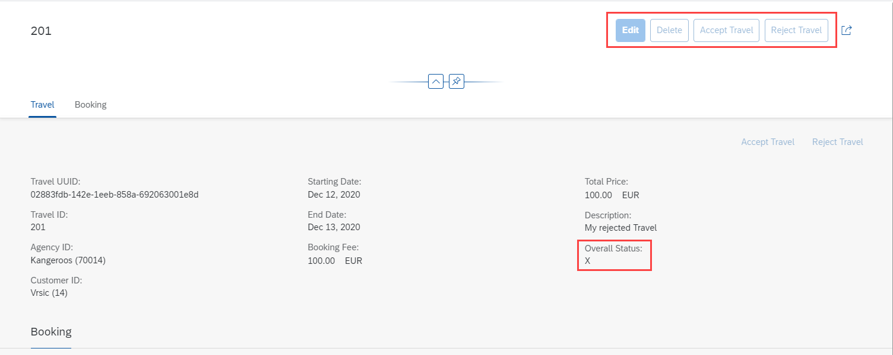

# Exercise 10 - Authorizations (optional)

## Introduction
In the previous exercise you've defined and implemented validations (see [Exercise 9](/exercises/ex9/README.md)).

In this exercise you will implement instance and global authorization control for the travel business object. For this we will create a new authorization field and an authorization object to demonstrate the authorization handling based on the field `TravelStatus`. The use case assumes that you are allowed to reject a travel (set the status to `X`) - but once saved, you may not change rejected travels anymore.

> Please note: The ABAP trial environment does not allow for adjusting the individual user authorizations. So we can only simulate how different authorizations behave by adjusting the corresponding method implementations.

Further information can be found here: [Adding Authorization Control to Managed Business Objects](https://help.sap.com/viewer/923180ddb98240829d935862025004d6/Cloud/en-US/375a8124b22948688ac1c55297868d06.html)

## Exercise 10.1 - Authorization Field

1.	Underneath your package in the Project Explorer, right-click on **Authorizations** and select **`New > Authorization Field`** from the context menu (in case the **Authorizations** entry is not visible, right-click on the package name and choose **Load Full Content F5** / **Refresh F5**).

    > **Please note**: In case no **Authorizations** folder is available in your exercise package in the _Project Explorer_ view, then do as follows:
    > 1. right-click on your exercise package and select **`New > Other ABAP Repository Objects`** from the context menu. 
    > 2. In the appearing dialog, enter the text *`Authorizations Field`* in the filter field.
    > 3. Select the appropriate entry and press on *Finish* to continue.
 
    

2.	Maintain **`ZOSTAT####`** (where `####` is your group ID) as **name** in the creation wizard and choose **Next >**.  

    
    
3.	Assign a transport request and choose **Finish**. The new authorization field appears in the editor. 

    Enter **`/DMO/OVERALL_STATUS`** into the **Data Element** field. 

    
    
4.  Save  the authorization field. An activation is not required. Keep the editor open.

## Exercise 10.2 - Authorization Object

1.	Choose **Create a new Authorization Object and assign the Authorization Field to it** from the _**What's next?**_ section.

    
    
2.	Maintain **`ZOSTAT####`** (where `####` is your group ID) as name and a description (e.g. _**Authorization object for Travel Status**_) in the creation wizard and choose **Next >** to continue.  
    
    
    
3.	Assign a transport request and choose **Finish**. The new authorization object appears in the editor. 

    The previously created authorization field **`ZOSTAT####`** and the default activity field **`ACTVT`** are both listed in the _**Authorization Fields**_ area. 
    
    Maintain the permitted activities in the _**Permitted Activities**_ area in the editor. Double click _**\<Enter new value\>**_ and enter the four activities below as shown on the screenshot. The description is filled automatically.
    - **`01`** (Add or Create)
    - **`02`** (Change)
    - **`03`** (Display) 
    - **`06`** (Delete)   
    
    
    
4.  Save  the changes to activate the authorization object. The **Object Class** will be filled automatically.  

## Exercise 10.3 - Define the Authorization Master and the Authorization Dependent
The **authorization master** defines the node where the authorization checks are implemented. Currently only the root node can be defined as authorization master. All other nodes in the composition hierarchy have to be defined as **authorization dependent**, delegating authorization requests via the association to the corresponding master.

1. Open the base behavior definition **`ZI_RAP_Travel_####`** – where **`####`** is your group ID – of your business object by either double-clicking on it in the _Project Explorer_ or using the shortcut **Ctrl+Shift+A** (_Open ABAP Development Object_).

2. Add the following line into the **Travel** entity, right after the `etag master LocalLastChangedAt` statement.

    <pre>
    authorization master ( instance, global )
    </pre>

    

3. Add the following line into the **Booking** entity, right after the `etag master LocalLastChangedAt` statement.

    <pre>
    authorization dependent by _Travel
    </pre>

    

4. Save  and activate  the behavior definition.

## Exercise 10.4 - Behavior Implementation

1. You can again use the Quick Fix marker to add the missing implementations into the local handler class. This approach would be used in a regular development flow.

    

2. In this exercise we replace the entire code with the prepared one. Open the behavior implementation class **zbp_i_rap_travel_####** for the **Travel** entity. Replace the **entire** code on the **_Local Types tab_** with the following coding and replace all occurrences of  `####` with your group ID:

    [Behavior Implementation Class ZBP_I_RAP_TRAVEL_####](sources/EX10_4_CLAS_ZBP_I_RAP_TRAVEL.txt)

    This declares and implements both authorization methods as well as three helper methods. 
    
    The three helper methods **is_update_granted**, **is_delete_granted** and **is_create_granted** are used to perform the actual `AUTHORITY-CHECK` calls, returning a boolean flag indicating the operation is granted or not. 
    
    > As already mentioned, the individual user authorizations can not be adjusted in the ABAP trial environment - therefore limited authorizations need to be simulated by adjusting the method implementations (which is of course not the recommended approach in a productive use case). 
    
    The instance authorization handler **get_authorizations** calculates the requested authorizations against the state present in the persistent table `zrap_atrav_####` (which is called _before-image_ in the implementation). Editing of active instances is only possible if the user has the authorization for the related travel status. This covers the _Edit Draft_ use-case, in which an active instance exists. For editing _New Drafts_ the implementation validates the create authorization.
    
    The RAP framework provides the importing parameter `requested_authorizations` when calling the instance authorization handler. This structure consists of flags for which the authorizations need to be calculated. The sample implementation maps these flags to the typical activities used in the authorization object (`01` - Create, `02`- Update and `06`- Delete), and uses the above mentioned helper methods to perform the actual authority-check calls.
    
    The global authorization handler **get_global_authorizations** can be used for instance independent authorizations, like the **create** operation or any static actions. But the exit can also be used for instance specific operations (e.g. update or delete), in case the operation is not allowed in general (to avoid calculating this for each instance again and again). 
    
    Please note that - depending on the scenario - authorization checks not only need to be implemented in these 2 authorization exists. In a scenario where e.g. the user authorization does not allow for entering a certain value into an editable field, you also need to define and implement a corresponding validation that calls the authority-check with the current field value.
        
    > In the UI use case the authorization result is exposed via so-called user hints. This allows the Fiori Elements UI to enable/disable related operations based on the existing user authorization. These hints are merged with the result from the instance specific feature control implementation.
    
## Exercise 10.5 - Preview the Travel App
1. Use the service binding to start the app preview. Make sure to launch the **Travel** entity set. In case the browser window is still open it's also sufficient to simply reload (F5) the page.

    As a result, editing / deleting a rejected (status = `X`) travel is not possible anymore.
  
    

## Summary

Now that you've... 
- created an authorization field and an authorization object, 
- defined the authorization master and dependent in the base behavior definition and
- implemented the authorization exits in the behavior implementation class, 

you are done with this workshop. Congratulations!

## Appendix

Find the source code for the base behavior definition, the travel behavior implementation class in the [sources](sources) folder. Don't forget to replace the placeholder `####` with your group ID.

- [Behavior Definition ZI_RAP_TRAVEL_####](sources/EX10_3_BDEF_ZI_RAP_TRAVEL.txt)
- [Behavior Implementation Class ZBP_I_RAP_Travel_####](sources/EX10_4_CLAS_ZBP_I_RAP_TRAVEL.txt)

