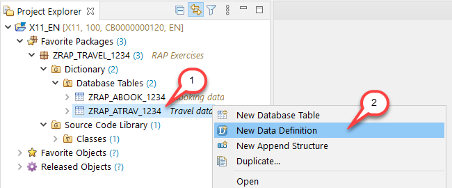
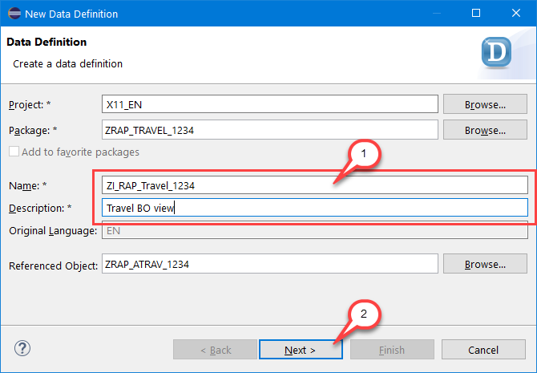
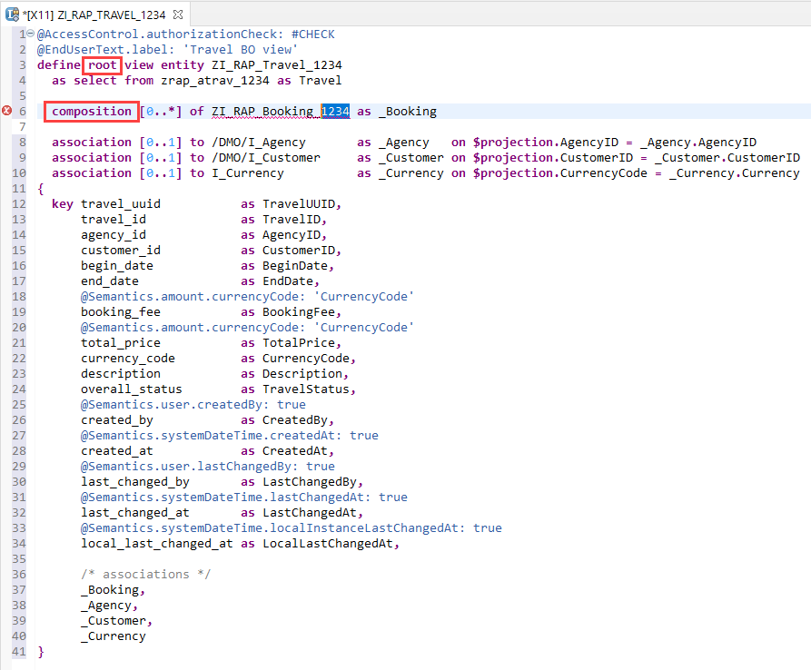
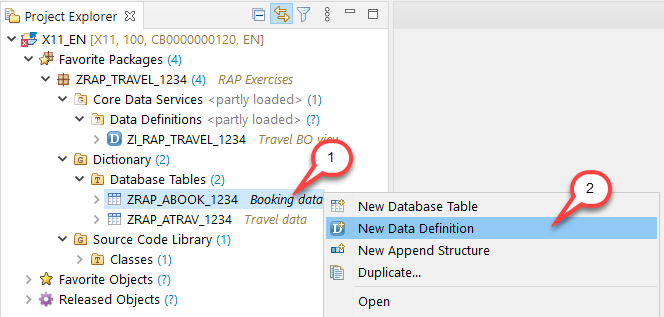
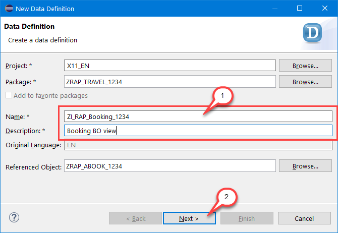
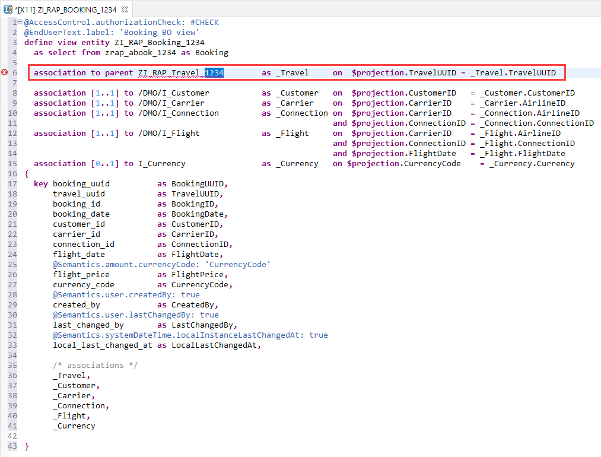
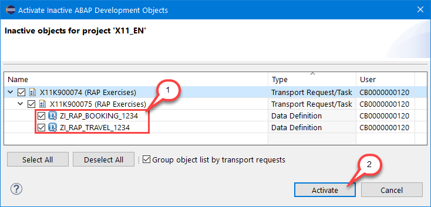

# Exercise 2 - Core Data Services (CDS) Data Model

## Introduction
In the previous exercise you've created the database tables for the demo Travel app and filled them with sample data (see [Exercise 1](/exercises/ex1/README.md)).

In this exercise you will define the travel and the booking interface views of the CDS data model for the travel app. 

We assume that you are familiar with working with ABAP CDS views. Further information can be found here: [ABAP CDS Development User Guide](https://help.sap.com/viewer/f859579898c7494dbe2449bb7f278dcc/Cloud/en-US)

## Exercise 2.1 - Create the Interface CDS View for the Travel entity

1. Right-click on your travel table **`ZRAP_ATRAV_####`** and choose **New Data Definition** from the context menu.
 
    

2.  Maintain **` ZI_RAP_Travel_####`** (where `####` is your group ID) as name and a **description** (e.g. _Travel BO view_) in the creation wizard and choose **Next** to continue.  
    > In this exercise, we will follow the naming convention of the Virtual Data Model (VDM) of the SAP S/4HANA where the name of interface and BO views begins with _`<namespace>I`_ and the name of consumption views begins with the namespace followed by _`<namespace>C`_.
   
    

3. Assign a transport request and choose **Finish** (please note: clicking on **Next** in the _Selection of Transport Request_ step, you get to the optional _Templates_ step in which you can choose from predefined templates). 

    Replace the code of the travel data definition in the editor with the code snippet provided below and replace all occurrences of  `####` with your group ID. You can make use of the Replace All feature (**Ctrl+F**) in ADT for this purpose.

    <pre>
    @AccessControl.authorizationCheck: #CHECK
    @EndUserText.label: 'Travel BO view'
    define root view entity ZI_RAP_Travel_####
      as select from zrap_atrav_#### as Travel

      composition [0..*] of ZI_RAP_Booking_#### as _Booking

      association [0..1] to /DMO/I_Agency       as _Agency   on $projection.AgencyID = _Agency.AgencyID
      association [0..1] to /DMO/I_Customer     as _Customer on $projection.CustomerID = _Customer.CustomerID
      association [0..1] to I_Currency          as _Currency on $projection.CurrencyCode = _Currency.Currency  
    {
      key travel_uuid           as TravelUUID,
          travel_id             as TravelID,
          agency_id             as AgencyID,
          customer_id           as CustomerID,
          begin_date            as BeginDate,
          end_date              as EndDate,
          @Semantics.amount.currencyCode: 'CurrencyCode'
          booking_fee           as BookingFee,
          @Semantics.amount.currencyCode: 'CurrencyCode'
          total_price           as TotalPrice,
          currency_code         as CurrencyCode,
          description           as Description,
          overall_status        as TravelStatus,
          @Semantics.user.createdBy: true
          created_by            as CreatedBy,
          @Semantics.systemDateTime.createdAt: true
          created_at            as CreatedAt,
          @Semantics.user.lastChangedBy: true
          last_changed_by       as LastChangedBy,
          @Semantics.systemDateTime.lastChangedAt: true
          last_changed_at       as LastChangedAt,
          @Semantics.systemDateTime.localInstanceLastChangedAt: true
          local_last_changed_at as LocalLastChangedAt,

          /* associations */
          _Booking,
          _Agency,
          _Customer,
          _Currency      
    }
    </pre>

    The travel data definition should look as follows:

    
    
    Our composition model consists of two nodes: The root node travel and its child node booking. The root node is explicitly defined by adding the keyword **`root`** to the define statement. Associations that define the composition model are explicitly defined using the keyword **`composition`**. Their corresponding on-condition is defined in the child entity.

    >**Note:** Save your changes, but do **not yet activate** the CDS view. This will be done via **mass activation** once the CDS view for the booking entity has been defined.

## Exercise 2.2 - Create the Interface CDS View for the Booking entity

1. Right-click on your booking table **`ZRAP_ABOOK_####`** and choose **New Data Definition** from the context menu.

    

2.  Maintain **`ZI_RAP_Booking_####`** (where `####` is your group ID) as name and a **description** (e.g. _Booking BO view_) in the creation wizard and choose **Next** to continue.  
 
    

3. Assign a transport request and choose **Finish**. Replace the code of the booking data definition in the editor with the code snippet provided below and replace all occurrences of  `####` with your group ID. You can make use of the Replace All feature (**Ctrl+F**) in ADT for this purpose.

    <pre>
    @AccessControl.authorizationCheck: #CHECK
    @EndUserText.label: 'Booking BO view'
    define view entity ZI_RAP_Booking_####
      as select from zrap_abook_#### as Booking

      association to parent ZI_RAP_Travel_####        as _Travel     on  $projection.TravelUUID = _Travel.TravelUUID

      association [1..1] to /DMO/I_Customer           as _Customer   on  $projection.CustomerID   = _Customer.CustomerID
      association [1..1] to /DMO/I_Carrier            as _Carrier    on  $projection.CarrierID    = _Carrier.AirlineID
      association [1..1] to /DMO/I_Connection         as _Connection on  $projection.CarrierID    = _Connection.AirlineID
                                                                     and $projection.ConnectionID = _Connection.ConnectionID
      association [1..1] to /DMO/I_Flight             as _Flight     on  $projection.CarrierID    = _Flight.AirlineID
                                                                     and $projection.ConnectionID = _Flight.ConnectionID
                                                                     and $projection.FlightDate   = _Flight.FlightDate
      association [0..1] to I_Currency                as _Currency   on $projection.CurrencyCode    = _Currency.Currency    
    {
      key booking_uuid          as BookingUUID,
          travel_uuid           as TravelUUID,
          booking_id            as BookingID,
          booking_date          as BookingDate,
          customer_id           as CustomerID,
          carrier_id            as CarrierID,
          connection_id         as ConnectionID,
          flight_date           as FlightDate,
          @Semantics.amount.currencyCode: 'CurrencyCode'
          flight_price          as FlightPrice,
          currency_code         as CurrencyCode,
          @Semantics.user.createdBy: true
          created_by            as CreatedBy,
          @Semantics.user.lastChangedBy: true
          last_changed_by       as LastChangedBy,
          @Semantics.systemDateTime.localInstanceLastChangedAt: true
          local_last_changed_at as LocalLastChangedAt,

          /* associations */
          _Travel,
          _Customer,
          _Carrier,
          _Connection,
          _Flight,
          _Currency

    }
    </pre>

    The booking data definition should look as follows:

    
    
    In the child node, you define the corresponding **`to parent`** association with the related on-condition.

    Save your changes, but do **not yet activate** the CDS view.

## Exercise 2.3 - Activate the CDS Data Model

To avoid errors during the activation, both new CDS views – i.e. the Travel interface view and the Booking interface view – must be activated together for the first time.  

1.	Choose **Activate All**  or use the shortcut **Ctrl+Shift+F3**, select both CD views **`ZI_RAP_TRAVEL_####`** and **`ZI_RAP_BOOKING_####`**  in the appearing dialog, and press **Activate** to active them together.
 
    

    Both views are now activated, but warnings are displayed in the _Problems_ view and in the editor. The reason behind this is that the authority check is allowed for these CDS views (`@AccessControl.authorizationCheck: #CHECK`), but no CDS access control is currently defined for them. 
    
    
    
    The creation of the CDS access control will not be covered in the session. Further information can be found here: [Access Controls](https://help.sap.com/viewer/f859579898c7494dbe2449bb7f278dcc/Cloud/en-US/7072ee4d6bf41014b5040bee4e204223.html)

## Summary

Now that you've... 
- created both CDS interface views and 
- activated them using mass activation, 

you can continue with - [Exercise 3 - CDS Data Model Projection](../ex3/README.md)

## Appendix

Find the source code for the CDS views in the [sources](sources) folder. Don't forget to replace the placeholder `####` with your group ID.

- [CDS View ZI_RAP_TRAVEL_####](sources/EX2_1_DDLS_ZI_RAP_TRAVEL.txt)
- [CDS View ZI_RAP_BOOKING_####](sources/EX2_2_DDLS_ZI_RAP_BOOKING.txt)
