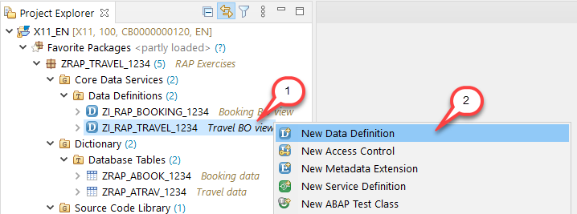
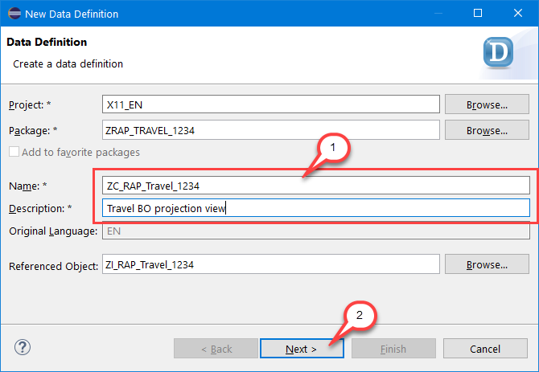
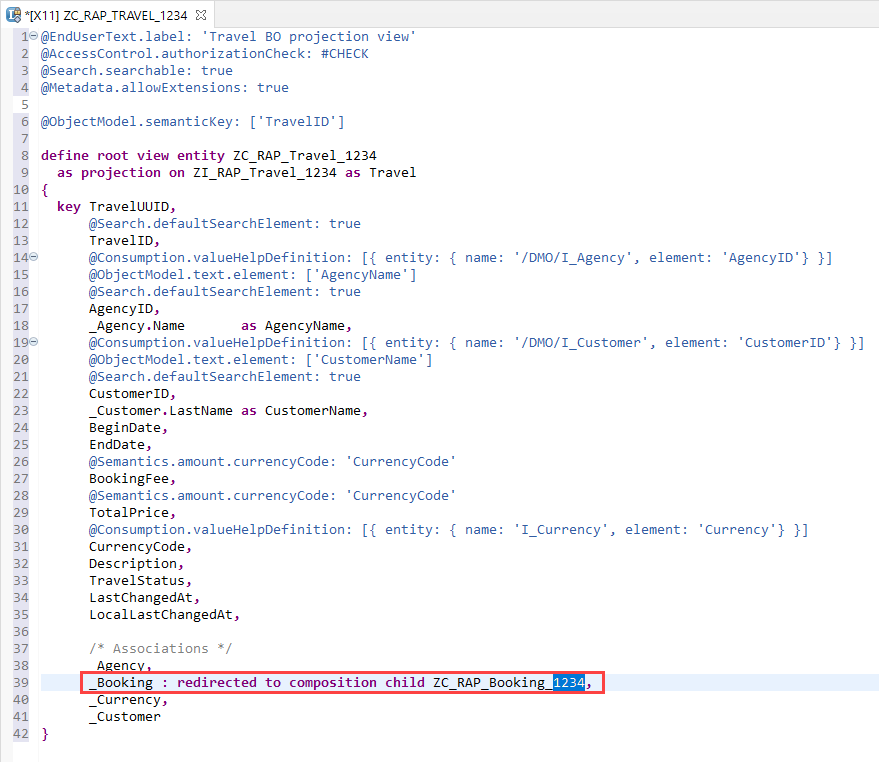
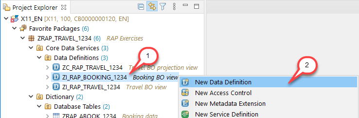
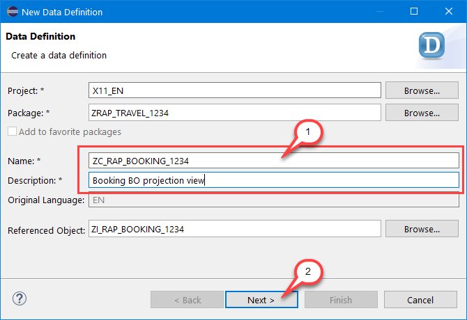
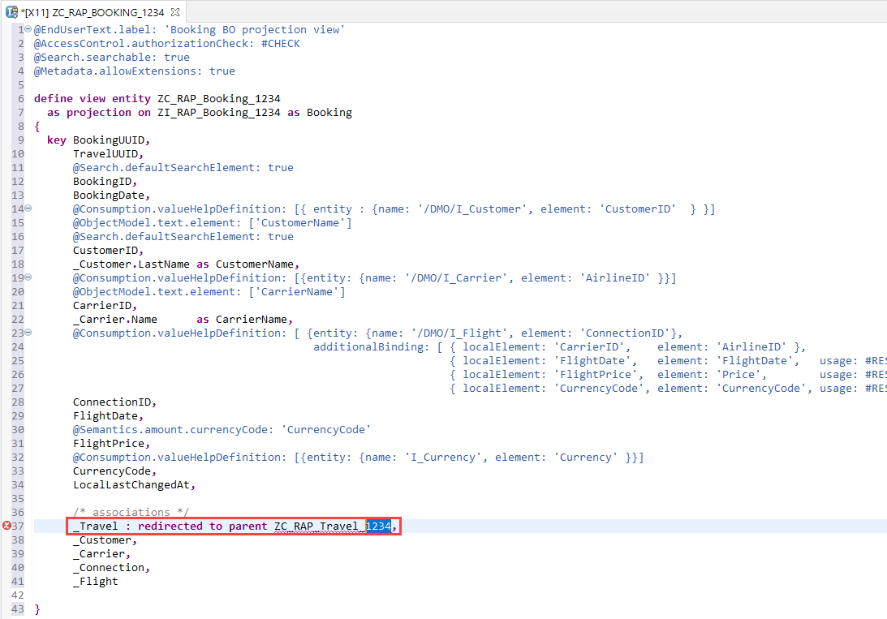
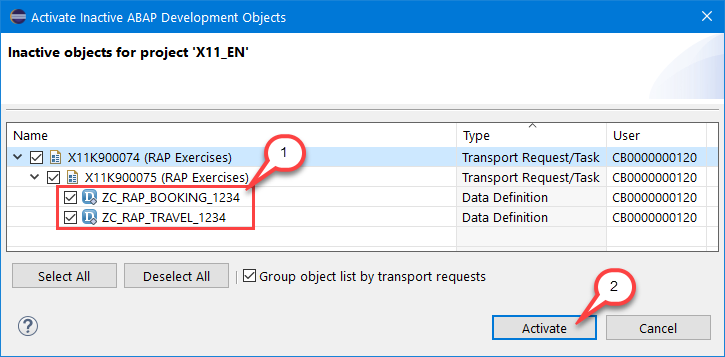

# Exercise 3 - CDS Data Model Projection

## Introduction
In the previous exercise you've created the travel and the booking interface views of the CDS data model for the travel app (see [Exercise 2](/exercises/ex2/README.md)).

In this exercise you will define the CDS data model projection for your travel app on top of the CDS data model.

Further information can be found here: [CDS Projection View](https://help.sap.com/viewer/923180ddb98240829d935862025004d6/Cloud/en-US/448c144391764977aefea5e1984ced38.html)

## Exercise 3.1 - Create the Travel Projection View

1. Right-click on your travel BO view (aka interface view) **`ZI_RAP_Travel_####`** and choose **New Data Definition** from the context menu.
 
    

2.  Maintain **`ZC_RAP_Travel_####`** (where `####` is your group ID) as name and a **description** (e.g. _Travel BO projection view_) in the creation wizard and choose **Next >** to continue. 

    

3. Assign a transport request and choose **Finish** (please note: clicking on **Next** in the _Selection of Transport Request_ step, you get to the optional _Templates_ step in which you can choose from predefined templates).

    Replace the travel data definition in the editor with the code snippet provided below and replace all occurrences of  `####` with your group ID. 

    Save  the changes, but **DO NOT** yet activate the travel BO projection view.

    <pre>
    @EndUserText.label: 'Travel BO projection view'
    @AccessControl.authorizationCheck: #CHECK
    @Search.searchable: true
    @Metadata.allowExtensions: true

    @ObjectModel.semanticKey: ['TravelID']

    define root view entity ZC_RAP_Travel_####
      as projection on ZI_RAP_Travel_#### as Travel
    {
      key TravelUUID,
          @Search.defaultSearchElement: true
          TravelID,
          @Consumption.valueHelpDefinition: [{ entity: { name: '/DMO/I_Agency', element: 'AgencyID'} }]
          @ObjectModel.text.element: ['AgencyName']
          @Search.defaultSearchElement: true
          AgencyID,
          _Agency.Name       as AgencyName,
          @Consumption.valueHelpDefinition: [{ entity: { name: '/DMO/I_Customer', element: 'CustomerID'} }]
          @ObjectModel.text.element: ['CustomerName']
          @Search.defaultSearchElement: true
          CustomerID,
          _Customer.LastName as CustomerName,
          BeginDate,
          EndDate,
          @Semantics.amount.currencyCode: 'CurrencyCode'
          BookingFee,
          @Semantics.amount.currencyCode: 'CurrencyCode'
          TotalPrice,
          @Consumption.valueHelpDefinition: [{ entity: { name: 'I_Currency', element: 'Currency'} }]
          CurrencyCode,
          Description,
          TravelStatus,
          LastChangedAt,
          LocalLastChangedAt,

          /* Associations */
          _Agency,
          _Booking : redirected to composition child ZC_RAP_Booking_####,
          _Currency,
          _Customer   
    }
    </pre>

    The data definition should look as follows: 

    
    
    The Travel projection view exposes all associations that are defined in the underlying travel interface view. However, the composition to the booking BO child node (**`_Booking`**) must be redirected to the Booking BO projection view. This is done using the **`redirected to composition child`** statement.

## Exercise 3.2 - Create the Booking Projection View

1. Right-click on your Booking BO view (aka interface view) **`ZI_RAP_BOOKING_####`** and choose **New Data Definition** from the context menu.
 
    

2.  Maintain **`ZC_RAP_BOOKING_####`** (where `####` is your group ID) as name and a description (e.g. _Booking BO projection view_) in the creation wizard and choose **Next >** to continue.  
 
    

3. Assign a transport request and choose **Finish**. Replace the booking data definition in the editor with the code snippet provided below and replace all occurrences of  `####` with your group ID. 

    Save  the changes, but **DO NOT** yet activate the booking BO projection view.
    
    <pre>
    @EndUserText.label: 'Booking BO projection view'
    @AccessControl.authorizationCheck: #CHECK
    @Search.searchable: true
    @Metadata.allowExtensions: true

    define view entity ZC_RAP_Booking_####
      as projection on ZI_RAP_Booking_#### as Booking
    {
      key BookingUUID,
          TravelUUID,
          @Search.defaultSearchElement: true
          BookingID,
          BookingDate,
          @Consumption.valueHelpDefinition: [{ entity : {name: '/DMO/I_Customer', element: 'CustomerID'  } }]
          @ObjectModel.text.element: ['CustomerName']
          @Search.defaultSearchElement: true
          CustomerID,
          _Customer.LastName as CustomerName,
          @Consumption.valueHelpDefinition: [{entity: {name: '/DMO/I_Carrier', element: 'AirlineID' }}]
          @ObjectModel.text.element: ['CarrierName']
          CarrierID,
          _Carrier.Name      as CarrierName,
          @Consumption.valueHelpDefinition: [ {entity: {name: '/DMO/I_Flight', element: 'ConnectionID'},
                                               additionalBinding: [ { localElement: 'CarrierID',    element: 'AirlineID' },
                                                                    { localElement: 'FlightDate',   element: 'FlightDate',   usage: #RESULT},
                                                                    { localElement: 'FlightPrice',  element: 'Price',        usage: #RESULT },
                                                                    { localElement: 'CurrencyCode', element: 'CurrencyCode', usage: #RESULT } ] } ]
          ConnectionID,
          FlightDate,
          @Semantics.amount.currencyCode: 'CurrencyCode'
          FlightPrice,
          @Consumption.valueHelpDefinition: [{entity: {name: 'I_Currency', element: 'Currency' }}]
          CurrencyCode,
          LocalLastChangedAt,

          /* associations */
          _Travel : redirected to parent ZC_RAP_Travel_####,
          _Customer,
          _Carrier,
          _Connection,
          _Flight

    }
    </pre>

    The data definition now looks as follows: 
    
     
     
     The association to the travel BO parent node has been redirected to the Travel BO projection view using the **`redirect to parent`** statement.

## Exercise 3.3 - Activate the CDS Data Model Projection 
To avoid error during the activation, both new CDS projection views – i.e. Travel view and Booking view – must be activated together for the first time.

1.	Choose **`Activate All`**  or use the shortcut **Ctrl+Shift+F3** to active both CDS views together.
 
    

    Your projected CDS data model consisting of the Travel BO projection view and the Booking BO projection view is now activated.
    

## Summary

Now that you've... 
- created both CDS projection views and 
- activated them using mass activation, 

you can continue with - [Exercise 4 - Metadata Extensions](../ex4/README.md)

## Appendix

Find the source code for the CDS views in the [sources](sources) folder. Don't forget to replace the placeholder `####` with your group ID.

- [CDS View ZC_RAP_TRAVEL_####](sources/EX3_1_DDLS_ZC_RAP_TRAVEL.txt)
- [CDS View ZC_RAP_BOOKING_####](sources/EX3_2_DDLS_ZC_RAP_BOOKING.txt)
