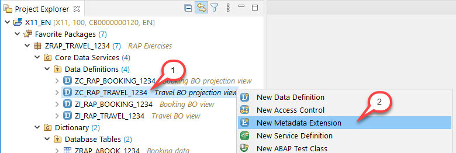
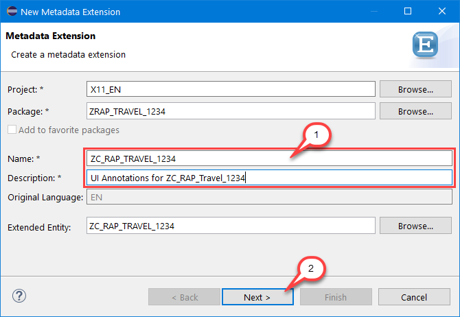
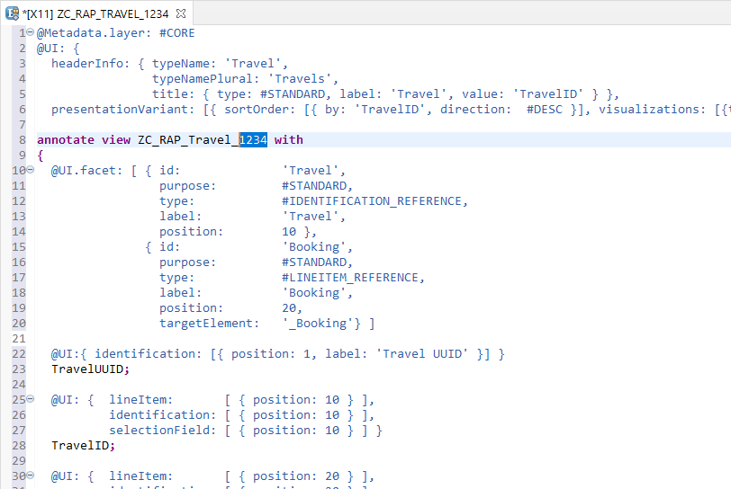
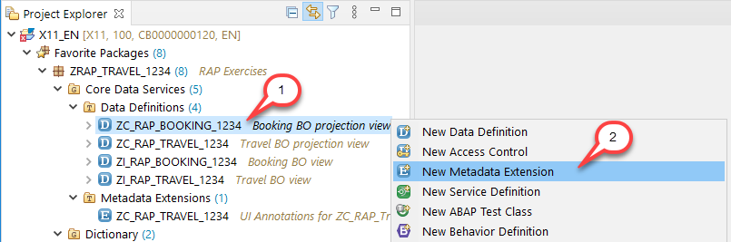
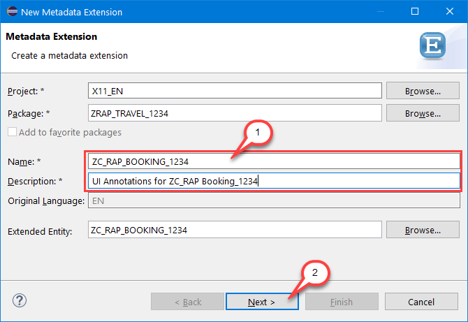

# Exercise 4 - Metadata Extensions

## Introduction
In the previous exercise you've created the travel and the booking projection views of the CDS data model for the travel app (see [Exercise 3](/exercises/ex3/README.md)).

In this exercise you will enrich your CDS data model projection with UI metadata. This metadata defines e.g. the columns and fields shown on the list report page as well as on the object page in the SAP Fiori elements Travel app.  

Further information can be found here: [Metadata Extensions](https://help.sap.com/viewer/f859579898c7494dbe2449bb7f278dcc/Cloud/en-US/a3ff1dc494a242ef98d1e22670e1546a.html)

## Exercise 4.1 - Annotate the Travel Projection View

1.	Right-click on your Travel BO projection view **`ZC_RAP_Travel_####`** in the Project Explorer and select **New Metadata Extension** from the context menu.     
                                                  
    
 
2.	Maintain **`ZC_RAP_Travel_####`** (where `####` is your group ID) as name and a description (e.g. _UI Annotations for ZC\_RAP\_Travel\_####_) and choose _**Next >**_ to continue.
 
    

3.	Assign a transport request and choose **Finish** (please note: clicking on **Next** in the _Selection of Transport Request_ step, you get to the optional _Templates_ step in which you can choose from predefined templates). 

    Replace the code in the editor with the code provided below and replace all occurrences of  `####` with your group ID.

    <pre>
    @Metadata.layer: #CORE
    @UI: {
      headerInfo: { typeName: 'Travel',
                    typeNamePlural: 'Travels',
                    title: { type: #STANDARD, label: 'Travel', value: 'TravelID' } },
      presentationVariant: [{ sortOrder: [{ by: 'TravelID', direction:  #DESC }], visualizations: [{type: #AS_LINEITEM}] }] }

    annotate view ZC_RAP_Travel_#### with
    {
      @UI.facet: [ { id:              'Travel',
                     purpose:         #STANDARD,
                     type:            #IDENTIFICATION_REFERENCE,
                     label:           'Travel',
                     position:        10 },
                   { id:              'Booking',
                     purpose:         #STANDARD,
                     type:            #LINEITEM_REFERENCE,
                     label:           'Booking',
                     position:        20,
                     targetElement:   '_Booking'} ]

      @UI:{ identification: [{ position: 1, label: 'Travel UUID' }] }
      TravelUUID;

      @UI: {  lineItem:       [ { position: 10 } ],
              identification: [ { position: 10 } ],
              selectionField: [ { position: 10 } ] }
      TravelID;

      @UI: {  lineItem:       [ { position: 20 } ],
              identification: [ { position: 20 } ],
              selectionField: [ { position: 20 } ] }
      AgencyID;

      @UI: {  lineItem:       [ { position: 30 } ],
              identification: [ { position: 30 } ],
              selectionField: [ { position: 30 } ] }
      CustomerID;

      @UI: {  lineItem:       [ { position: 40 } ],
              identification: [ { position: 40 } ] }
      BeginDate;

      @UI: {  lineItem:       [ { position: 50 } ],
              identification: [ { position: 50 } ] }
      EndDate;

      @UI: {  lineItem:       [ { position: 60 } ],
              identification: [ { position: 60 } ] }
      BookingFee;

      @UI: {  lineItem:       [ { position: 70 } ],
              identification: [ { position: 70 } ] }
      TotalPrice;

      @UI: {  lineItem:       [ { position: 80 } ],
              identification: [ { position: 80 } ] }
      Description;

      @UI: {  lineItem:       [ { position: 90 }
    //                          , { type: #FOR_ACTION, dataAction: 'acceptTravel', label: 'Accept Travel' },
    //                            { type: #FOR_ACTION, dataAction: 'rejectTravel', label: 'Reject Travel' }
                              ],
              identification: [ { position: 90 }
    //                          , { type: #FOR_ACTION, dataAction: 'acceptTravel', label: 'Accept Travel' },
    //                            { type: #FOR_ACTION, dataAction: 'rejectTravel', label: 'Reject Travel' }
                              ] } 
      TravelStatus;

      @UI.hidden: true
      LastChangedAt;

      @UI.hidden: true
      LocalLastChangedAt;

      @UI.selectionField: [{ element: '_Booking.CarrierID', position: 40 }]
      _Booking;
    }
    </pre>

     The results looks as follows:    
     
    

4.	Save  and activate  the changes.  

## Exercise 4.2 - Annotate the Booking Projection View

1.	Right-click on your Booking BO projection view **`ZC_RAP_Booking_####`** in the Project Explorer and choose **New Metadata Extension** from the context menu.
 
    

2.	Maintain **`ZC_RAP_Booking_####`** (where `####` is your group ID) as name and a description (e.g. _UI Annotations for ZC\_RAP\_Booking\_####_)  and choose **Next >** to continue.
 
    
    
3.	Assign a transport request and choose **Finish**. Replace the code in the editor with the code provided below and replace all occurrences of  `####` with your group ID.

    <pre>
    @Metadata.layer: #CORE
    @UI: {
      headerInfo: { typeName: 'Booking',
                    typeNamePlural: 'Bookings',
                    title: { type: #STANDARD, value: 'BookingID' } } }

    annotate view ZC_RAP_Booking_#### with
    {
      @UI.facet: [ { id:            'Booking',
                     purpose:       #STANDARD,
                     type:          #IDENTIFICATION_REFERENCE,
                     label:         'Booking',
                     position:      10 }  ]

      @UI: { identification: [ { position: 10, label: 'Booking UUID'  } ] }
      BookingUUID;

      @UI.hidden: true
      TravelUUID;

      @UI: { lineItem:       [ { position: 20 } ],
             identification: [ { position: 20 } ] }
      BookingID;

      @UI: { lineItem:       [ { position: 30 } ],
             identification: [ { position: 30 } ] }
      BookingDate;

      @UI: { lineItem:       [ { position: 40 } ],
             identification: [ { position: 40 } ] }
      CustomerID;

      @UI: { lineItem:       [ { position: 50 } ],
             identification: [ { position: 50 } ] }
      CarrierID;

      @UI: { lineItem:       [ { position: 60 } ],
             identification: [ { position: 60 } ] }
      ConnectionID;

      @UI: { lineItem:       [ { position: 70 } ],
             identification: [ { position: 70 } ] }
      FlightDate;

      @UI: { lineItem:       [ { position: 80 } ],
             identification: [ { position: 80 } ] }
      FlightPrice;

      @UI.hidden: true
      LocalLastChangedAt;
    }
    </pre>
 
4.	Save  and activate  the changes.  

## Summary

Now that you've... 
- created both metadata extensions for the CDS projection views, 

you can continue with - [Exercise 5 - Business Service](../ex5/README.md)

## Appendix

Find the source code for the CDS views in the [sources](sources) folder. Don't forget to replace the placeholder `####` with your group ID.

- [Metadata Extension ZC_RAP_TRAVEL_####](sources/EX4_1_DDLX_ZC_RAP_TRAVEL.txt)
- [Metadata Extension ZC_RAP_BOOKING_####](sources/EX4_2_DDLX_ZC_RAP_BOOKING.txt)
