# Exercise 6 - Business Object Behavior

## Introduction
In the previous exercise you've created the service definition and the service binding, and you've used the app preview to run the application (see [Exercise 5](/exercises/ex5/README.md)).

In this exercise you will define the business object behavior for the Travel and the Booking entities. 

Further information can be found here: [Business Object](https://help.sap.com/viewer/923180ddb98240829d935862025004d6/Cloud/en-US/a3ff9dcdb25a4f1a9408422b8ba5fa00.html)

## Exercise 6.1 - Base Behavior Definition
The behavior definition specifies the transactional capabilities of the business object.

1.	Right-click on the CDS view  **`ZI_RAP_TRAVEL_####`** in the Project Explorer and choose **New Behavior Definition**.
 
       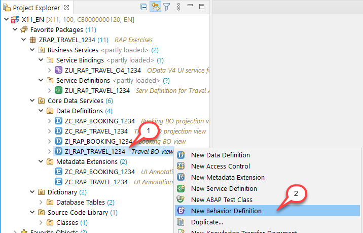

2.	The _New Behavior Definition_ wizard is shown. The _Name_ of the behavior definition has to be the identical name as the root CDS view. That’s the reason why the name can’t be changed. Ensure that the _Implementation Type_ is set to **Managed**  and choose **Next >**.
        
    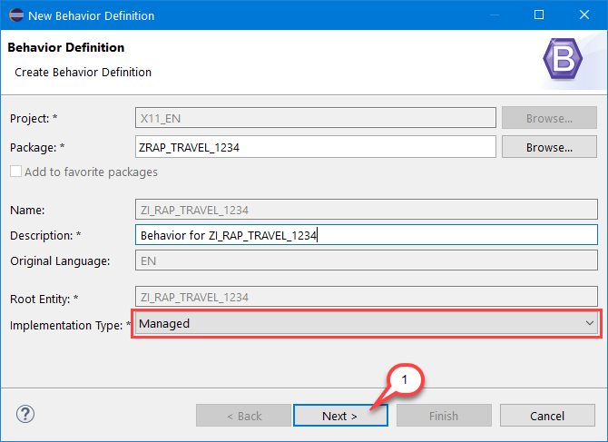
    
3.	Assign a transport request and choose **Finish**. A behavior definition skeleton for the entire composition hierarchy – i.e. the Travel entity **`ZI_RAP_Travel_####`** and the Booking entity **`ZI_RAP_Booking_####`**  in this scenario – is generated. 

    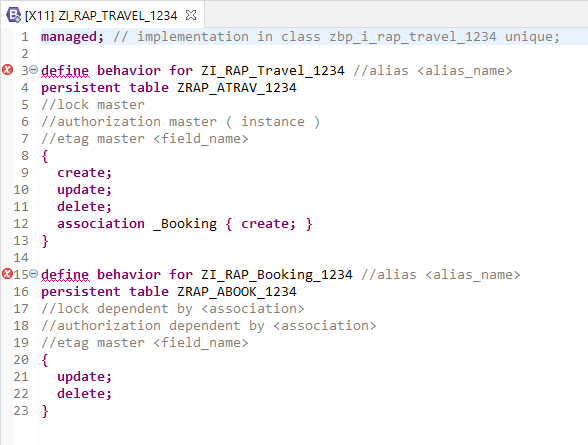
    
    **Short explanation:**
    -	**`managed`** is specified as implementation type at the top.
    -	The basic CUD – Create, Update and Delete – operations are specified for both entities. 
    -	New booking entities can be created by association from a travel entity.
    - The persistent tables specify the database tables the managed runtime uses to write new/updated records into.
    
    You will adjust the behavior definition in the next steps.

4. Replace the code in the editor with the code provided below and replace all occurrences of  `####` with your group ID.

    <pre>
    managed;
    with draft;

    define behavior for ZI_RAP_Travel_#### alias Travel
    implementation in class zbp_i_rap_travel_#### unique
    persistent table zrap_atrav_####
    draft table zrap_dtrav_####
    lock master total etag LastChangedAt
    etag master LocalLastChangedAt
    {
      create;
      update;
      delete;
      association _Booking { create; with draft; }

      field ( numbering : managed, readonly ) TravelUUID;
      field ( readonly  ) TravelId, TotalPrice, TravelStatus;
      field ( readonly  ) LastChangedAt, LastChangedBy, CreatedAt, CreatedBy, LocalLastChangedAt;
      field ( mandatory ) AgencyID, CustomerID;

      mapping for zrap_atrav_####
      {
        TravelUUID         = travel_uuid;
        TravelID           = travel_id;
        AgencyID           = agency_id;
        CustomerID         = customer_id;
        BeginDate          = begin_date;
        EndDate            = end_date;
        BookingFee         = booking_fee;
        TotalPrice         = total_price;
        CurrencyCode       = currency_code;
        Description        = description;
        TravelStatus       = overall_status;
        CreatedBy          = created_by;
        CreatedAt          = created_at;
        LastChangedBy      = last_changed_by;
        LastChangedAt      = last_changed_at;
        LocalLastChangedAt = local_last_changed_at;
      }
    }

    define behavior for ZI_RAP_Booking_#### alias Booking
    implementation in class zbp_i_rap_booking_#### unique
    persistent table zrap_abook_####
    draft table zrap_dbook_####
    lock dependent by _Travel
    etag master LocalLastChangedAt
    {
      update;
      delete;

      association _Travel { with draft; }

      field ( numbering : managed, readonly ) BookingUUID;
      field ( readonly ) TravelUUID, BookingId;
      field ( readonly ) CreatedBy, LastChangedBy, LocalLastChangedAt;

      mapping for zrap_abook_####
      {
        BookingUUID        = booking_uuid;
        TravelUUID         = travel_uuid;
        BookingID          = booking_id;
        BookingDate        = booking_date;
        CustomerID         = customer_id;
        CarrierID          = carrier_id;
        ConnectionID       = connection_id;
        FlightDate         = flight_date;
        FlightPrice        = flight_price;
        CurrencyCode       = currency_code;
        CreatedBy          = created_by;
        LastChangedBy      = last_changed_by;
        LocalLastChangedAt = local_last_changed_at;
      }
    }
    </pre>

     The results looks as follows - containing some errors/warnings that we will fix now:    
     
    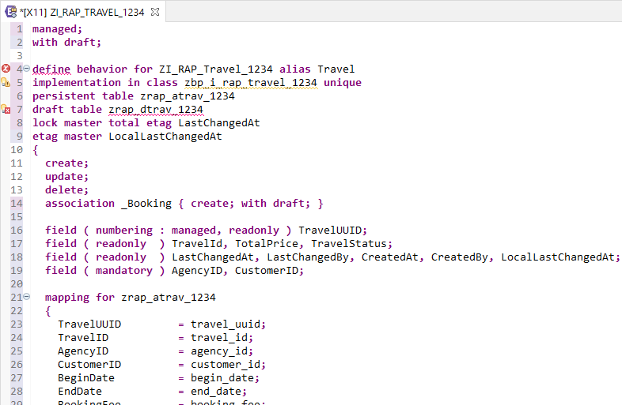

    **Short explanation:**
    -	**`with draft`** is specified next to the implementation type at the top. This enables the draft handling for this RAP business object.
    - Once draft is enabled, a **`draft table`** has to be specified for each node of the RAP business object. _Please note:_ the ADT tooling supports you in generating/re-generating the draft table definition.  
    - The **`lock master`** defines the node implementing the lock exit. All entities using the same _lock shadow_ point to their lock master using the **`lock dependent by <association>`** syntax. _Please note:_ Currently only one lock master can be specified in a RAP business object, and this lock master has to be the root node. In a managed implementation the lock is generically handled by the managed runtime.
    - The **`total etag`** is used to identify changes to _active_ instances in cases where the durable lock has expired. The CDS annotation `@Semantics.systemDateTime.lastChangedAt: true` in the interface view ensures the managed runtime takes care for updating the value.
    - The **`etag master`** is used for optimistic locking. This is required e.g. in cases where active instances are updated, to avoid performing an action on outdated data. An etag master can be specified on each node (which is the recommended approach).
    - The **`mapping`** maps the CDS view element names to the names used in the persistent table. This is required by the managed runtime to insert/update records. Don't forget to add the corresponding mapping when adding new fields to the data model.

## Exercise 6.2 - Draft tables

1. Click on the Quick Fix icon in the line with the draft table declaration (`draft table zrap_dtrav_####`) to open the Quick Fix context menu. Double-click the entry **Create draft table zrap_dtrav_#### for entity zi_rap_travel_####**.
     
    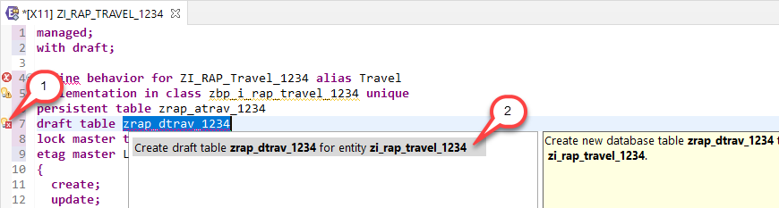

2. In the _New Draft Table_ wizard leave the defaulted values and click **Next >**.
     
    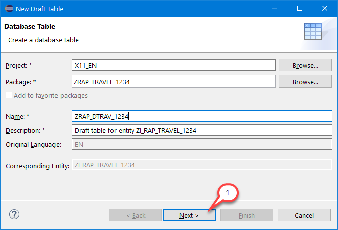

3. Assign a transport request and choose **Finish**. The editor opens with the definition of the draft table based on the elements specified in the Travel interface CDS view.

    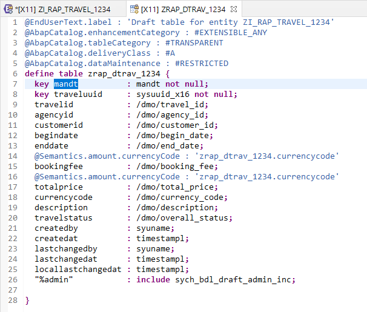

4. Save  and activate  the table definition.

5. Go back to the behavior definition, scroll down to the booking entity and perform the same steps for the draft table **zrap_dbook_####**:
   - Click on the Quick Fix icon in the line `draft table zrap_dbook_####`
   - In the Quick Fix context menu double-click **Create draft table zrap_dbook_#### for entity zi_rap_booking_####**
   - Click **Next >** in the _New Draft Table_ wizard, assign a transport request and click **Finish**
   - Save and activate the table definition
   
## Exercise 6.3 - Behavior Implementation Classes

1. Go back to the behavior definition, and save  and activate  it. Two warnings remain that we will fix now.

    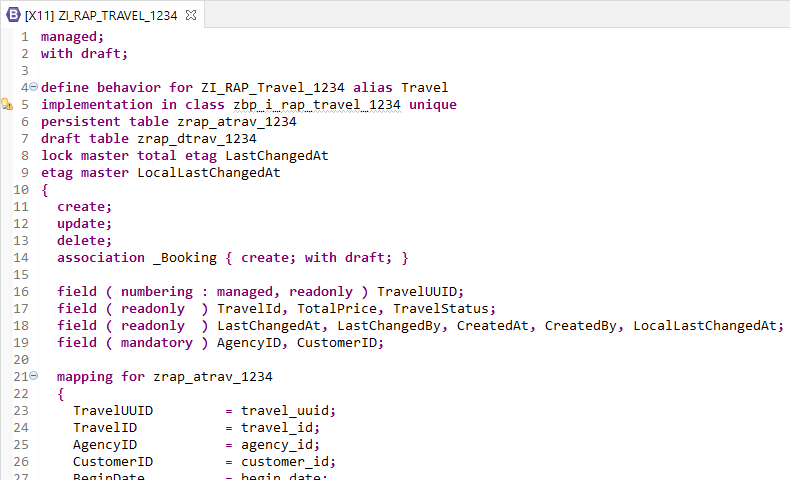

2. Click on the Quick Fix icon in the line with the implementation class for the travel entity (`implementation in class zbp_i_rap_travel_#### unique`) to open the Quick Fix context menu. Double-click the entry **Create behavior implementation class zbp_i_rap_travel_####**. 

    Alternatively you can put the cursor on the highlighted statement (`zbp_i_rap_travel_####`) and press **Ctrl+1**. This also opens the Quick Fix context menu.

    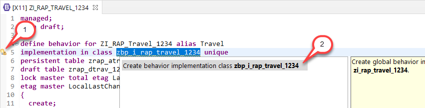

3. In the _New Behavior Class_ wizard leave the defaulted values and click **Next >**.

    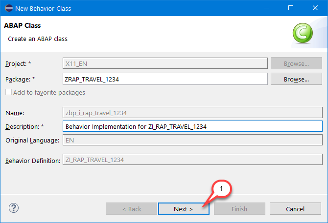

4. Assign a transport request and choose **Finish**. The editor opens with the defaulted behavior class.

    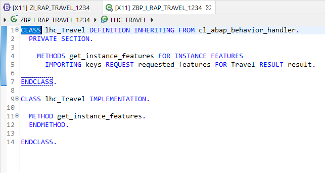

5. We will later on take care about the implementation. For now you can save  and activate  the class.

6. Go back to the behavior definition, scroll down to the booking entity and perform the same steps for the behavior implementation class **zbp_i_rap_booking_####**:
   - Click on the Quick Fix icon in the line `implementation in class zbp_i_rap_booking_#### unique`
   - In the Quick Fix context menu double-click **Create behavior implementation class zbp_i_rap_booking_####**
   - Click **Next >** in the _New Behavior Class_ wizard, assign a transport request and click **Finish**
   - The class is defaulted with only a comment but no coding. That is fine.

    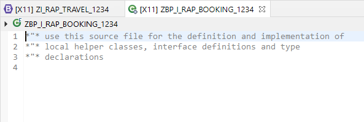

    Save  and activate  the class.
   
> Please note: In a behavior implementation class (also known as **Behavior Pool**) the implementation is done using local handler classes on the **Local Types** tab.

## Exercise 6.4 - Behavior Definition Projection
Similar to the CDS projection views also the behavior defined in the base behavior definition can be projected for individual use cases. 

Further information can be found here: [Business Object Projection](https://help.sap.com/viewer/923180ddb98240829d935862025004d6/Cloud/en-US/6e7a10d30b74412a9482a80b0b88e005.html)

1.	Right-click on the CDS projection view  **`ZC_RAP_TRAVEL_####`** in the Project Explorer and choose **New Behavior Definition**.
 
    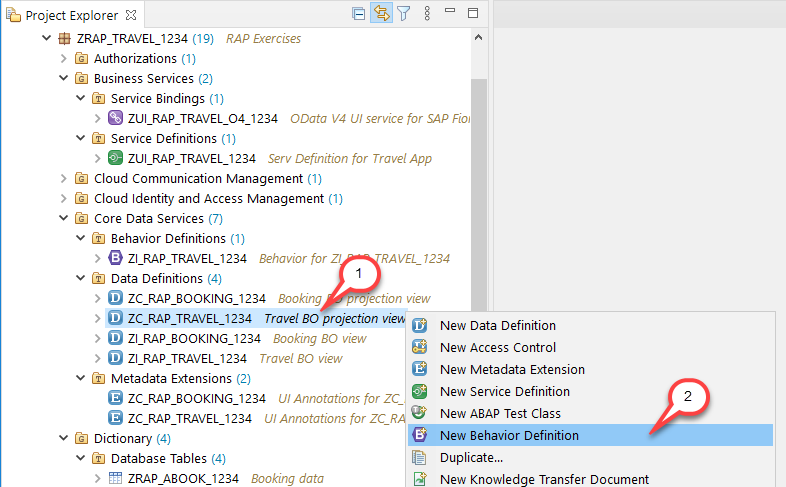

2.	The _New Behavior Definition_ wizard is shown. The _Name_ of the behavior definition has to be the identical name as the root CDS projection view. That’s the reason why the name can’t be changed. Ensure that the _Implementation Type_ is set to **Projection**  and choose **Next >**.
        
    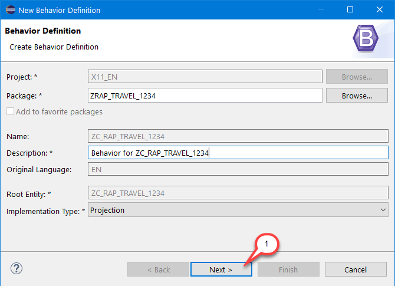
    
3.	Assign a transport request and choose **Finish**. A behavior definition projection for the projected composition hierarchy – i.e. the Travel entity **`ZC_RAP_Travel_####`** and the Booking entity **`ZC_RAP_Booking_####`**  in this scenario – is generated. 

    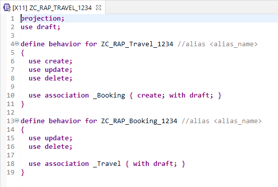
 
4. Replace the code in the editor with the code provided below and replace all occurrences of  `####` with your group ID.

    <pre>
    projection;
    use draft;

    define behavior for ZC_RAP_Travel_#### alias Travel
    use etag
    {
      use create;
      use update;
      use delete;

      use association _Booking { create; with draft; }
    }

    define behavior for ZC_RAP_Booking_#### alias Booking
    use etag
    {
      use update;
      use delete;

      use association _Travel { with draft; }
    }
    </pre>
    
    **Short explanation:**
    - The **`projection`** keyword declares the behavior definition as a projection. The link to the base behavior definition is defined via the root CDS _projection_ view, pointing to the root CDS _interface_ view.
    - In the projection you typically see the keyword **`use`**, indicating a certain feature is projected 

5.	Save  and activate  the behavior projection.

## Exercise 6.5 - Preview the Travel App 

1. Use the service binding to start the app preview. Make sure to launch the **Travel** entity set. In case the browser window is still open it's also sufficient to simply reload (F5) the page.

   > Please note: In the trial environment it might take a while until your changes are reflected. 
   > You may also, for example, empty your browser cache and trigger a hard reload.
   
   As a result, you can see that the create, update and delete operations are enabled.
  
    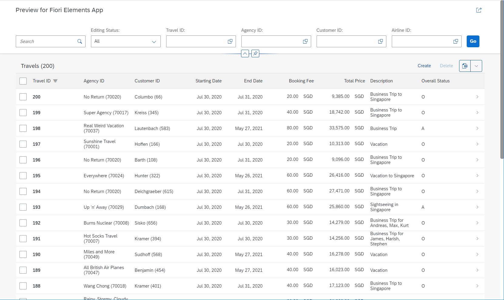
    
    Object Page:
    
    

2.	Feel free to play around with the application – e.g. create, delete or update/edit _travel_ and _booking_ entities.    

## Summary

Now that you've... 
- created the base behavior definition, 
- created both draft tables,
- created both behavior implementation classes and
- created the behavior definition projection,

you can continue with - [Exercise 7 - Actions](../ex7/README.md)

## Appendix

Find the source code for the base behavior definition and the behavior definition projection in the [sources](sources) folder. Don't forget to replace the placeholder `####` with your group ID.

- [Behavior Definition ZI_RAP_TRAVEL_####](sources/EX6_1_BDEF_ZI_RAP_TRAVEL.txt)
- [Behavior Definition ZC_RAP_TRAVEL_####](sources/EX6_2_BDEF_ZC_RAP_TRAVEL.txt)
