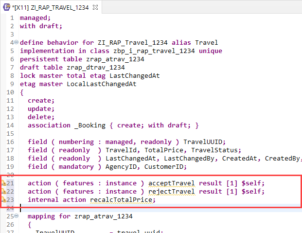
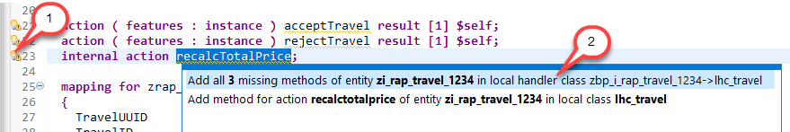
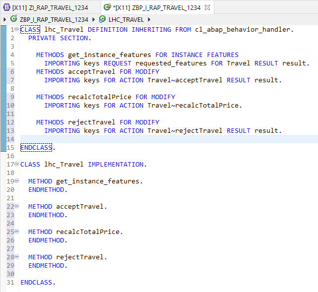
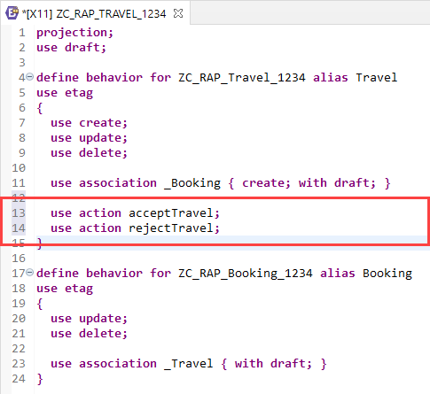
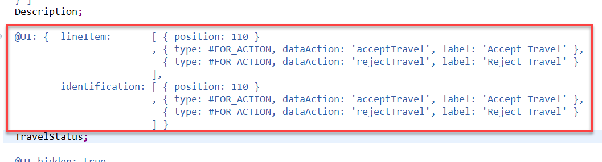
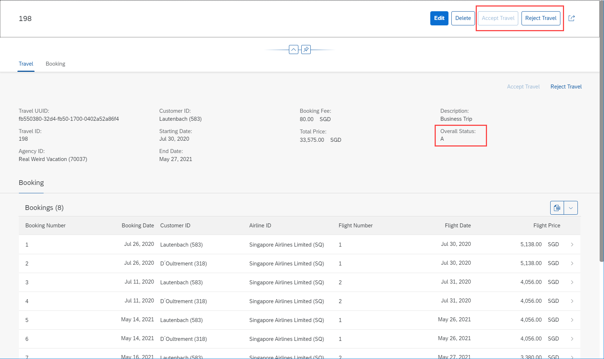

# Exercise 7 - Actions

## Introduction
In the previous exercise you've created the base behavior definition and the behavior definition projection (see [Exercise 6](/exercises/ex6/README.md)).

In this exercise you will add the actions acceptTravel and rejectTravel that will be offered as buttons in the Fiori app. Both actions will also make use of the instance specific feature control to enable/disable the buttons based on the current travel status.

You will furthermore add an internal action that is used to recalculate the total price.

Further information can be found here: [Actions](https://help.sap.com/viewer/923180ddb98240829d935862025004d6/Cloud/en-US/83bad707a5a241a2ae93953d81d17a6b.html)

> Please note: This exercise, as well as the subsequent ones require the use of the Entity Manipulation Language (EML) which is part of the ABAP language providing type-safe read and modifying access to RAP business objects. Further information can be found here: [Entity Manipulation Language (EML)](https://help.sap.com/viewer/923180ddb98240829d935862025004d6/Cloud/en-US/af7782de6b9140e29a24eae607bf4138.html)

## Exercise 7.1 - Base Behavior Definition
1. Open the base behavior definition **`ZI_RAP_Travel_####`** – where **`####`** is your group ID – of your business object by either double-clicking on it in the _Project Explorer_ or using the shortcut **Ctrl+Shift+A** (_Open ABAP Development Object_).

2. Add the following lines into the **Travel** entity, right after the `field` statements.

    <pre>
    action ( features : instance ) acceptTravel result [1] $self;
    action ( features : instance ) rejectTravel result [1] $self;
    internal action recalcTotalPrice;
    </pre>

    Your base behavior definition should look as follows:
    
    
    
3. Save  and activate  the behavior definition.

4. Click on any of the 3 Quick Fix markers to open the Quick Fix context menu. Choose **Add all 3 missing methods of entity zi_rap_travel_#### in local handler class zbp_i_rap_travel_####->lhc_travel**.

    

5. This is to demonstrate how to add method declarations into existing behavior implementation classes when adding more capabilities to the business object. The adjusted behavior implementation class (**Local Types** tab) looks as follows:

    

6. Replace the **entire** code of the behavior implementation class **zbp_i_rap_travel_####** (Local Types tab) with the following coding and replace all occurrences of  `####` with your group ID:

    > Find the source code here: [Behavior Implementation Class ZBP_I_RAP_TRAVEL_####](sources/EX7_1_CLAS_ZBP_I_RAP_TRAVEL.txt)

    This implements all four methods and declares the constants for the travel status.
    
    The **acceptTravel** and **rejectTravel** methods are almost identical. Both make use of the EML to modify the overall status for the provided travel instances. The `keys` table is filled by the framework and contains the keys of all instances the action is executed on. 
    
    The named include `%tky` is the so-called **transactional key**. For draft-enabled BOs it consists of the `%is_draft` indicator followed by the key of the entity (in this example `traveluuid` ). 
    
    In EML the addition **IN LOCAL MODE** is used for business object internal operations. It behaves like a private method call, and e.g. skips the feature and authorization control.
    
    The result table is filled with the updated instances as defined in the base behavior definition (`result [1] $self;`). This avoids another round trip for UI related use cases to fetch the updated data. 
    
    The **get_features** method implements the instance specific feature control (also called dynamic feature control). In the current example it enables/disables the acceptTravel and rejectTravel actions based on the current travel status. Instance specific capabilities have to be implemented in this method once the related feature is declared with `( features : instance )` in the base behavior definition. Further information can be found here: [Instance Feature Control Implementation: Dynamic Feature Control](https://help.sap.com/viewer/923180ddb98240829d935862025004d6/Cloud/en-US/9ee0a7073fef4f889e85862114b85fdd.html)
    
    The **recalctotalprice** method is the implementation for the internal action `recalcTotalPrice` that we will use in the next exercise when adding determinations to the behavior definition. The method calculates the total price, summing up all flight prices and adding the booking fee on top. If required, the calculation performs a currency conversion.  

7. Save  and activate  the class.

## Exercise 7.2 - Behavior Definition Projection
Those actions, that need to be available in the exposed service need to be added to the behavior definition projection. In the current example this is required for the actions **acceptTravel** and **rejectTravel**.

1. Open the behavior definition projection **`ZC_RAP_Travel_####`** – where **`####`** is your group ID – of your business object by either double-clicking on it in the _Project Explorer_ or using the shortcut **Ctrl+Shift+A** (_Open ABAP Development Object_).

2. Add the following lines into the **Travel** entity, right after the `use association _Booking` statement.

    <pre>
    use action acceptTravel;
    use action rejectTravel;
    </pre>

    Your behavior definition projection should look as follows:
    
    
    
3. Save  and activate  the behavior definition.

## Exercise 7.3 - Metadata Extension
For the actions to become available as buttons on the Fiori Elements UI you need to add corresponding UI annotations. This is done in the metadata extension for the travel entity.

1. Open the metadata extension **`ZC_RAP_TRAVEL_####`** – where **`####`** is your group ID – by either double-clicking on it in the _Project Explorer_ or using the shortcut **Ctrl+Shift+A** (_Open ABAP Development Object_).

 > Please note: If you are carrying out the **FAST TRACK** version of DEV260, then skip step 7.3.2 and go ahead with 7.3.3 directly. 

2. Scroll down and find the UI annotations for the **`TravelStatus`** element. Remove the comments for both actions for the UI.lineItem as well as the UI.identification annotation. Your metadata extension should look as follows:
    
    

3. \[FAST TRACK\] Scroll down and find the UI annotations for the **`TravelStatus`** element. Replace the existing **`@UI`** annotation blocks (`@UI.lineItem` and `@UI.identification`) with code snippet provided below to add both actions to the list report page and the object page.   
    
    <pre>
      @UI: {  lineItem:       [ { position: 110 }
                            , { type: #FOR_ACTION, dataAction: 'acceptTravel', label: 'Accept Travel' },
                              { type: #FOR_ACTION, dataAction: 'rejectTravel', label: 'Reject Travel' }
                          ],
          identification: [ { position: 110 }
                            , { type: #FOR_ACTION, dataAction: 'acceptTravel', label: 'Accept Travel' },
                              { type: #FOR_ACTION, dataAction: 'rejectTravel', label: 'Reject Travel' }
                          ] } 
    </pre>

    Your metadata extension should look as follows:
    
    
    
4. Save  and activate  the metadata extension.

## Exercise 7.4 - Preview the Travel App 

1. Use the service binding to start the app preview. Make sure to launch the **Travel** entity set. In case the browser window is still open it's also sufficient to simply reload (F5) the page.

   > Please note: In the trial environment it might take a while until your changes are reflected. 
   > You may also, for example, empty your browser cache and trigger a hard reload.
   
   As a result, you can see that both new actions are available on the _list report_ as well as on the _object page_.
  
    
    
    Object Page:
    
    

2.	Feel free to play around with the application – e.g. see how the instance specific feature control enables/disables the buttons dynamically.    

## Summary

Now that you've... 
- added actions to the base behavior definition, 
- implemented the actions and the related instance feature control,
- projected the actions in the behavior definition projection and
- exposed them to the Fiori app,

you can continue with - [Exercise 8 - Determinations](../ex8/README.md)

## Appendix

Find the source code for the base behavior definition, the behavior implementation and the behavior definition projection in the [sources](sources) folder. Don't forget to replace the placeholder `####` with your group ID.

- [Behavior Definition ZI_RAP_TRAVEL_####](sources/EX7_1_BDEF_ZI_RAP_TRAVEL.txt)
- [Behavior Implementation Class ZBP_I_RAP_Travel_####](sources/EX7_1_CLAS_ZBP_I_RAP_TRAVEL.txt)
- [Behavior Definition ZC_RAP_TRAVEL_####](sources/EX7_2_BDEF_ZC_RAP_TRAVEL.txt)
- [Metadata Extension ZC_RAP_TRAVEL_####](sources/EX7_3_DDLX_ZC_RAP_TRAVEL.txt)
