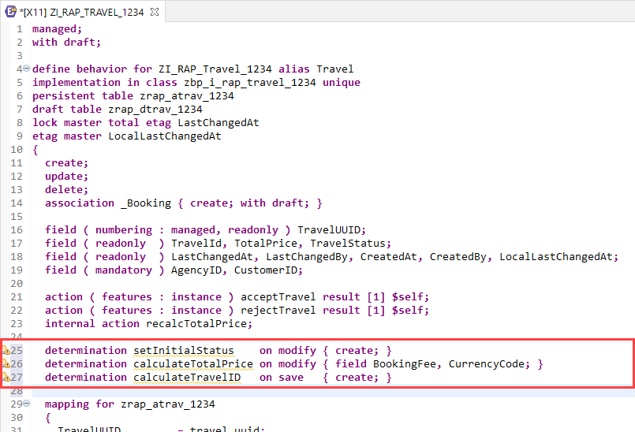
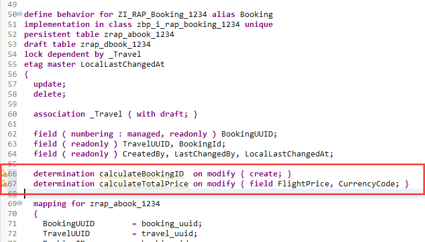
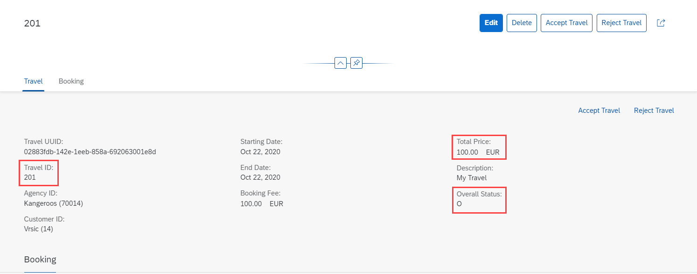

# Exercise 8 - Determinations

## Introduction
In the previous exercise you've defined, implemented and exposed actions (see [Exercise 7](/exercises/ex7/README.md)).

In this exercise you will add determinations to the base behavior definition of the Travel and Booking entity. Determinations allow you to handle side effects of modified entity instances. They are invoked by the framework as soon as a trigger condition at a predefined point in time, the determination time, is fulfilled. Possible triggers are e.g. a field change or the creation of an instance. Determinations times are `on modify` and `on save`. 

Further information can be found here: [Developing Determinations](https://help.sap.com/viewer/923180ddb98240829d935862025004d6/Cloud/en-US/6edb0438d3e14d18b3c403c406fbe209.html)

> Please note: Determinations have to be idempotent, i.e. they have to produce the same result even if the framework calls them multiple times.

## Exercise 8.1 - Base Behavior Definition
1. Open the base behavior definition **`ZI_RAP_Travel_####`** – where **`####`** is your group ID – of your business object by either double-clicking on it in the _Project Explorer_ or using the shortcut **Ctrl+Shift+A** (_Open ABAP Development Object_).

2. Add the following lines into the **Travel** entity, right after the previously defined actions.

    <pre>
    determination setInitialStatus    on modify { create; }
    determination calculateTotalPrice on modify { field BookingFee, CurrencyCode; }
    determination calculateTravelID   on save   { create; }
    </pre>

3. Add the following lines into the **Booking** entity, right after the `field` statements.

    <pre>
    determination calculateBookingID  on modify { create; }
    determination calculateTotalPrice on modify { field FlightPrice, CurrencyCode; }
    </pre>

    Your **Travel** entity in the base behavior definition should look as follows:
    
    

    Your **Booking** entity in the base behavior definition should look as follows:
    
    

3. Save  and activate  the behavior definition.

4. You can again use the Quick Fixes to generate or update the local handler classes in the related behavior implementation classes. This approach would be used in a regular development flow.

5. In this exercise we replace the entire code with the prepared one. Open the behavior implementation class **zbp_i_rap_travel_####** for the **Travel** entity. Replace the **entire** code on the **_Local Types tab_** with the following coding and replace all occurrences of  `####` with your group ID:

    > Find the source code here: [Behavior Implementation Class ZBP_I_RAP_TRAVEL_####](sources/EX8_1_CLAS_ZBP_I_RAP_TRAVEL.txt)

    This declares and implements three determinations. **setInitialStatus** sets the overall travel status to `Open` when a new travel instance is created.
    
    The determination **calculateTotalPrice** calls the previously defined internal action `recalcTotalPrice` to update the total price for a travel. It is triggered whenever the fields `BookingFee` or `CurrencyCode` change.
    
    Determination **calculateTravelID** is used to calculate a semantic key. Please note: This scenario uses a UUID (`traveluuid`) as key for each node of the business object calculated by the framework. The calculation of the semantic key `TravelID` is just used as an example. The implementation does not ensure for gap free or unique travel IDs.

6. Save  and activate  the class.

7. Open the behavior implementation class **zbp_i_rap_booking_####** for the **Booking** entity. Replace the **entire** code on the **_Local Types tab_** with the following coding and replace all occurrences of  `####` with your group ID:

    > Find the source code here: [Behavior Implementation Class ZBP_I_RAP_BOOKING_####](sources/EX8_1_CLAS_ZBP_I_RAP_BOOKING.txt)

    This declares and implements two determinations. **calculateBookingID** calculates a booking id for newly created booking instances - i.e. booking instances that do not yet have a booking id. For this the implementation first uses a read-by-association to read the associated travel header. From the header again a read-by-association takes place to read all existing bookings. With this information an internal `update` table is prepared to fill the booking id for those that don't yet have an id.
    
    Determination **calculateTotalPrice** is triggered whenever the `FlightPrice` or the `CurrencyCode` of a booking is changed. It calls the internal action `recalcTotalPrice` on travel level to update the total price.
    
8. Save  and activate  the class.

## Exercise 8.2 - Preview the Travel App
Determinations neither need to be projected, nor need to be added to the UI metadata. They are considered by the framework right away. 

1. Use the service binding to start the app preview. Make sure to launch the **Travel** entity set. In case the browser window is still open it's also sufficient to simply reload (F5) the page.

   As a result, when creating a new travel instance you can see the overall status is defaulted to `Open`. When you save the new instance, a travel ID as well as the total price is calculated.
  
    

## Summary

Now that you've... 
- added determinations to the base behavior definition and
- implemented them in the related behavior implementation class, 

you can continue with - [Exercise 9 - Validations](../ex9/README.md)

## Appendix

Find the source code for the base behavior definition, the travel and booking behavior implementation classes in the [sources](sources) folder. Don't forget to replace the placeholder `####` with your group ID.

- [Behavior Definition ZI_RAP_TRAVEL_####](sources/EX8_1_BDEF_ZI_RAP_TRAVEL.txt)
- [Behavior Implementation Class ZBP_I_RAP_Travel_####](sources/EX8_1_CLAS_ZBP_I_RAP_TRAVEL.txt)
- [Behavior Implementation Class ZBP_I_RAP_Booking_####](sources/EX8_1_CLAS_ZBP_I_RAP_BOOKING.txt)
