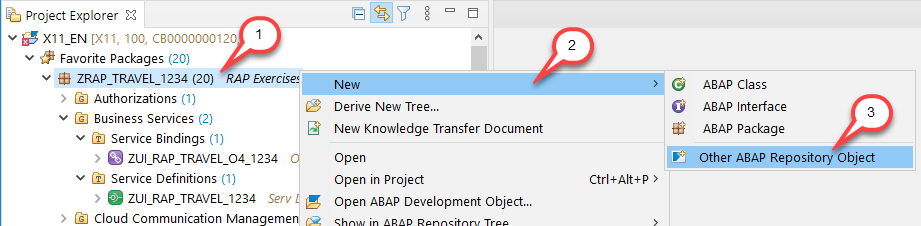
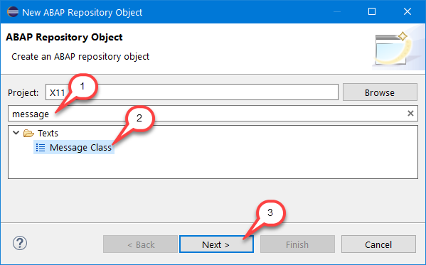
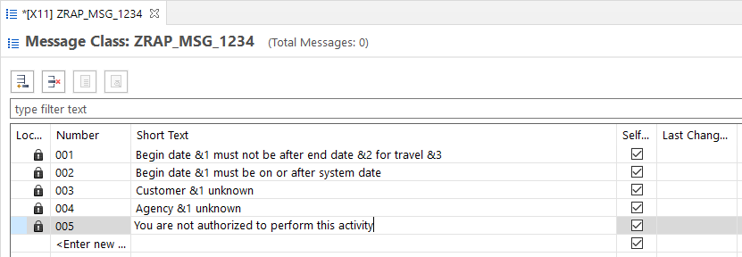
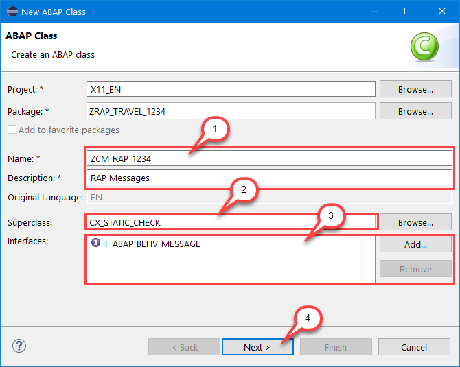
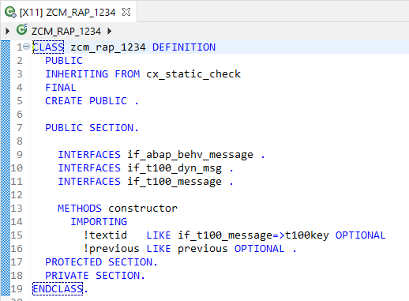
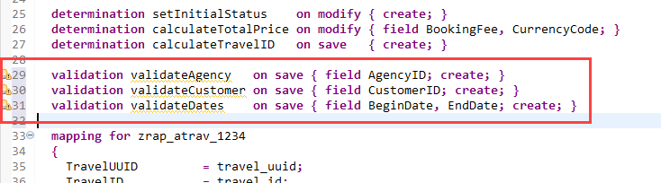
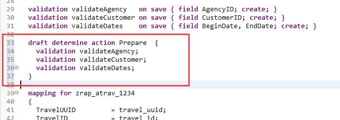
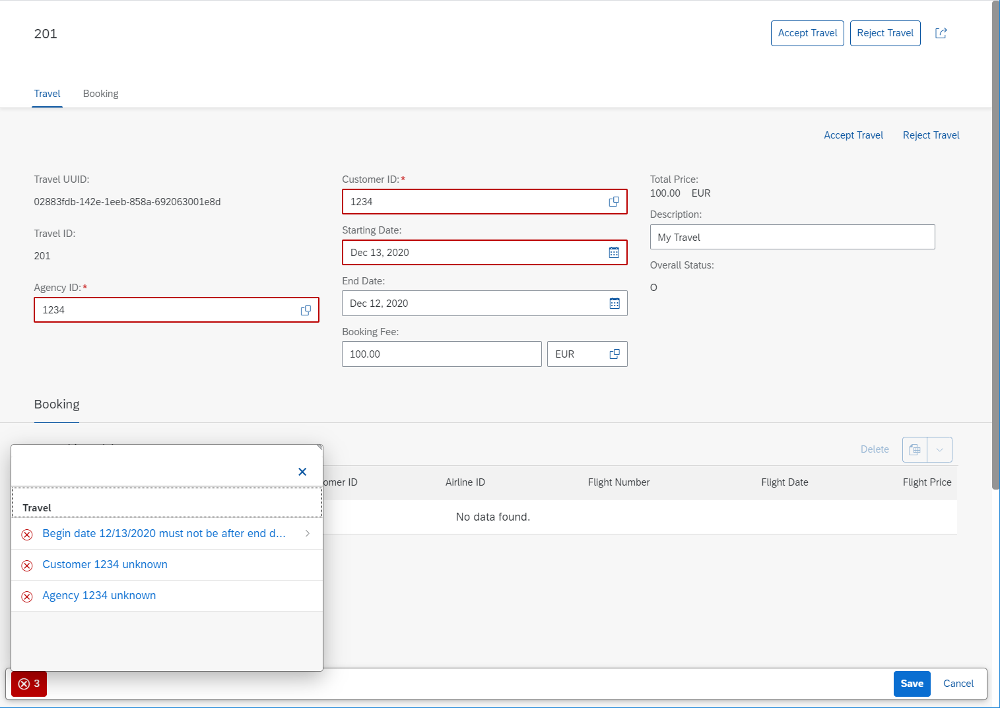
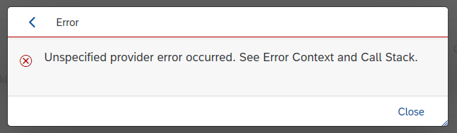

# Exercise 9 - Validations

## Introduction
In the previous exercise you've defined and implemented determinations (see [Exercise 8](/exercises/ex8/README.md)).

In this exercise you will add validations to the base behavior definition. Validations allow you to check the data consistency of an instance. It's implicitly invoked by the framework as soon as a trigger condition at a predefined point in time is fulfilled. Validations can return messages to the consumer and reject inconsistent instance data from being saved.

Further information can be found here: [Developing Validations](https://help.sap.com/viewer/923180ddb98240829d935862025004d6/Cloud/en-US/171e26c36cca42699976887b4c8a83bf.html)

## Exercise 9.1 - Message Class
In the behavior implementations, you will make use of your own _T100_ messages, raised by an own exception class. 
Therefore, you will first create the message class **`ZRAP_MSG_####`** to define your own `T100` messages and the exception class **`ZCM_RAP_####`**, where **`####`** is your group ID.

1.	Right-click on your package and choose _**New > Other ABAP Repository Object**_.

    

2.	In the creation wizard, filter the entries with **`message`** and choose **`Message Class`**. Then choose **Next >**.
    
    
        
3.	Maintain **`ZRAP_MSG_####`** as **name**, where **`####`** is your group ID, and a **description** (e.g. **`RAP messages`**) and choose **Next >**.
     
    
    
4.	Assign a transport request and click **Finish**. The new message class editor opens. Create five messages with the numbers **001** to **005** and the short texts provided below.
    
    <table>
    <tr> <td>001</td> <td>Begin date &1 must not be after end date &2 for travel &3</td> </tr>
    <tr> <td>002</td> <td>Begin date &1 must be on or after system date</td> </tr>
    <tr> <td>003</td> <td>Customer &1 unknown</td> </tr>
    <tr> <td>004</td> <td>Agency &1 unknown</td> </tr>
    <tr> <td>005</td> <td>You are not authorized to perform this activity</td> </tr>
    </tr>
    </table> 

    Your message class should look as follows:
    
    
    
5.	Save  the new message class to activate it.
 
## Exercise 9.2 - Exception Class

1.	Right-click on your package **`ZRAP_TRAVEL_####`** and choose _**New > ABAP Class**_.
    
    
    
2.	Maintain **`ZCM_RAP_####`** (where **`####`** is your group ID) as **name** and a **description** (e.g. **`RAP Messages`**).
    
    Maintain **`CX_STATIC_CHECK`** as **Superclass** and then add **`IF_ABAP_BEHV_MESSAGE`** under **Interfaces**.
    
    Choose **Next >**.
    
    
    
3.	Assign a transport request and choose **Finish**. The ABAP class skeleton is generated and displayed in the editor.
     
    
    
4.	Replace the **entire** code of the exception class with the following coding and replace all occurrences of `####` with your group ID:

    > Note: In case you are using letters in your group ID, make sure to perform the replacement with **capital** letters.

    > Find the source code here: [Exception Class ZCM_RAP_####](sources/EX9_2_CLAS_ZCM_RAP.txt)

    This defines five message constants for the five T100 messages the were defined before. It also specifies required variables for storing the message parameters. For parameters of type NUMC we perform an alpha conversion to remove leading zeros.

5. Save  and activate  the exception class.

## Exercise 9.3 - Behavior Definition - Validation
1. Open the base behavior definition **`ZI_RAP_Travel_####`** – where **`####`** is your group ID – of your business object by either double-clicking on it in the _Project Explorer_ or using the shortcut **Ctrl+Shift+A** (_Open ABAP Development Object_).

2. Add the following lines into the **Travel** entity, right after the previously defined determinations.

    <pre>
    validation validateAgency   on save { field AgencyID; create; }
    validation validateCustomer on save { field CustomerID; create; }
    validation validateDates    on save { field BeginDate, EndDate; create; }
    </pre>

    Your base behavior definition should look as follows:
    
    

3. Save  and activate  the behavior definition.

4. You can again use the Quick Fixes to update the local handler class in the behavior implementation class. This approach would be used in a regular development flow.

5. In this exercise we replace the entire code with the prepared one. Open the behavior implementation class **zbp_i_rap_travel_####** for the **Travel** entity. Replace the **entire** code on the **_Local Types tab_** with the following coding and replace all occurrences of  `####` with your group ID:

    > Find the source code here: [Behavior Implementation Class ZBP_I_RAP_TRAVEL_####](sources/EX9_3_CLAS_ZBP_I_RAP_TRAVEL.txt)

    This declares and implements three validations. 
    
    The validations **validateAgency** and **validateCustomer** are very similar. They use the EML to read the `AgencyIDs` / `CustomerIDs` for the provided keys, building a distinct internal table of the IDs. This table is checked against the corresponding value help table (`/dmo/agency` / `/dmo/customer`). Values that don't exist are invalid. For such travel keys a corresponding entry in the **`FAILED`** changing parameter is made. This declares the instance as inconsistent.
    
    In addition a corresponding message is added to the **`REPORTED`** changing parameter, making use of the previously implemented exception class. The message added to the reported parameter can be used by consumers (e.g. a Fiori Elements UI) to inform the end-user about the identified problem. 
    
    Messages can be raised as so-called _state messages_, belonging to the current state of the instance. If the state changes, they need to be removed from the message buffer. This is typically done at the beginning of a validation, by adding an entry to the reported parameter with the current transactional key `%tky` but with no message.
    
    Validation **validateDates** follows the same pattern. It validates the `BeginDate` and the `EndDate`. Either if the EndDate is earlier than the BeginDate or if the BeginDate is earlier than the system date, the travel instance is considered as inconsistent. In that case the `%tky` is added to the failed parameter and a corresponding message is added to the reported parameter, explaining the problem. 

    Further information about message handling can be found here: [Messages](https://help.sap.com/viewer/923180ddb98240829d935862025004d6/Cloud/en-US/ac74189b5cae49c1b091f04393bac069.html)

6. Save  and activate  the behavior implementation class.

## Exercise 9.4 - Behavior Definition - Draft Determine Action Prepare
Before draft instances become active, they are checked by the validations and determinations that are specified for the draft determine action prepare in the behavior definition. In our example we want all validations to be executed and thus we need to assign all of them to the special draft action `draft determine action Prepare`.

Further information can be found here: [Preparing Draft Instances for Activation](https://help.sap.com/viewer/923180ddb98240829d935862025004d6/Cloud/en-US/8eb32c2936904f95acffaec95ab1edd5.html) 

1. In the base behavior definition **`ZI_RAP_Travel_####`** – where **`####`** is your group ID – add the following lines into the **Travel** entity, right after the previously defined validations.

    <pre>
    draft determine action Prepare  {
      validation validateAgency;
      validation validateCustomer;
      validation validateDates;
    }
    </pre>

    Your base behavior definition should look as follows:
    
    

3. Save  and activate  the behavior definition.

## Exercise 9.5 - Preview the Travel App
1. Use the service binding to start the app preview. Make sure to launch the **Travel** entity set. In case the browser window is still open it's also sufficient to simply reload (F5) the page.

   As a result, when **saving** a travel instance with inconsistent data you can see corresponding error messages.
  
    

    In case you are getting an **Unspecified provider error occurred. See Error Context and Call Stack.** error, please ignore it. 

    
    
    This is a known backend problem that will be fixed with the upcoming release.
    
## Summary

Now that you've... 
- defined T-100 messages,
- created an exception class,
- added validations to the base behavior definition,
- implemented them in the behavior implementation class and
- assigned them to the draft determine action prepare, 

you can continue with - [Exercise 10 - Authorizations (optional)](../ex10/README.md)

## Appendix

Find the source code for the exception class, the base behavior definition and the travel behavior implementation class in the [sources](sources) folder. Don't forget to replace the placeholder `####` with your group ID.

- [Exception Class ZCM_RAP_####](sources/EX9_2_CLAS_ZCM_RAP.txt)
- [Behavior Definition ZI_RAP_TRAVEL_####](sources/EX9_4_BDEF_ZI_RAP_TRAVEL.txt)
- [Behavior Implementation Class ZBP_I_RAP_Travel_####](sources/EX9_3_CLAS_ZBP_I_RAP_TRAVEL.txt)
